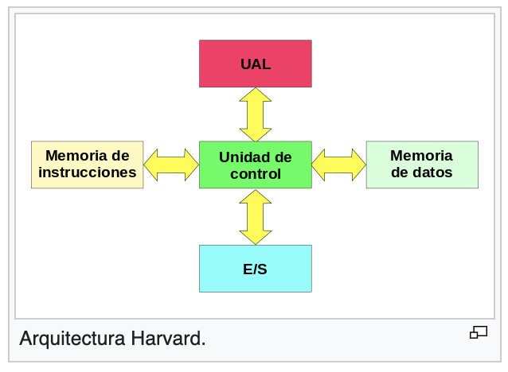
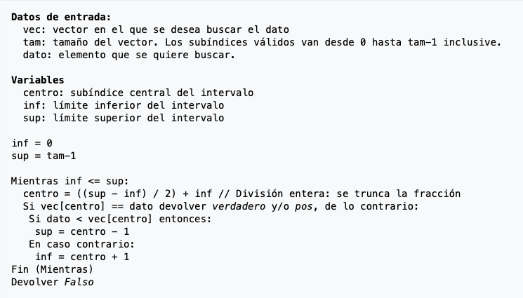
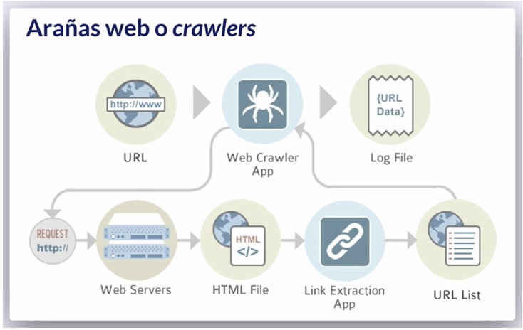
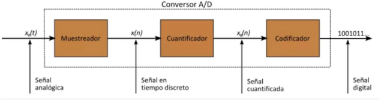
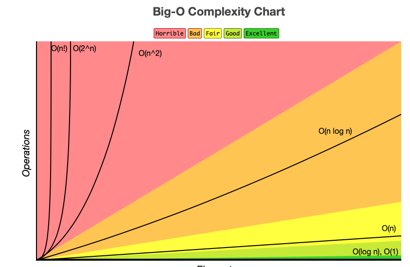
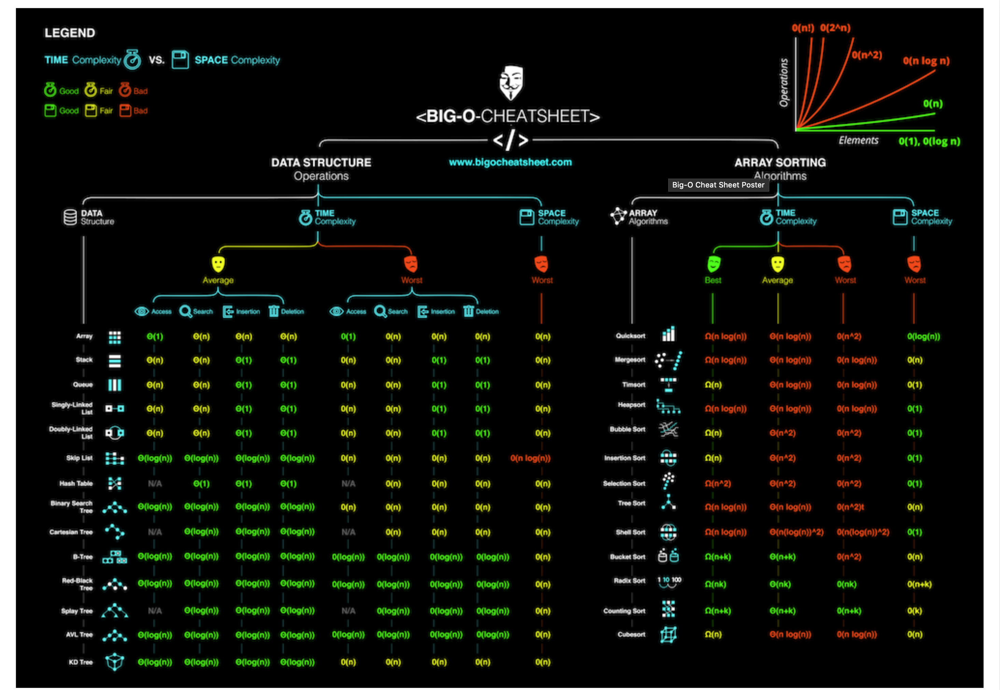
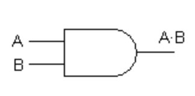
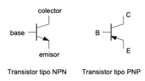
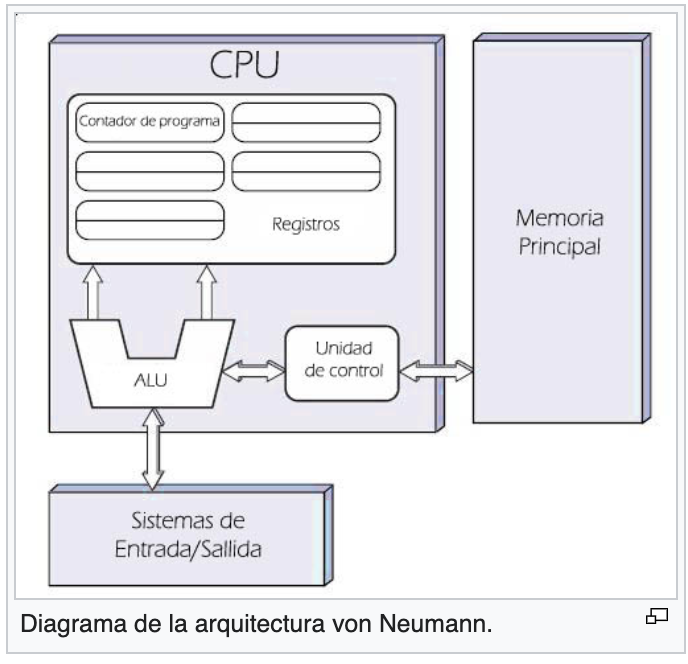

# Diccionario_The__Egg


# Indice
[A](#A) [B](#B) [C](#C) [D](#D) [E](#E) [F](#F) [G](#G) [H](#H) [I](#I) [J](#J) [K](#K) [L](#L) [M](#M) [N](#N) [O](#O) [P](#P) [Q](#Q) [R](#R) [S](#S) [T](#T) [U](#U) [V](#V) [X](#X)
<a name="A"></a>
## A

[Ada-lovelace](#Ada-lovelace)

[AJAX](#AJAX)

[Algebra-booleana](#Algebra-booleana)

[Algoritmo](#Algoritmo)

[Algoritmo-de-cifrado-simétrico](#Algoritmo-de-cifrado-simétrico)

[Algoritmo-de-cifrado-asimétrico](#Algoritmo-de-cifrado-asimétrico)

[Algoritmos-de-ordenación](#Algoritmos-de-ordenación)

[Análisis-exploratorio](#Análisis-exploratorio)

[API](#API)

[Arduino](#Arduino)

[Arquitectura-cliente-servidor](#Arquitectura-cliente-servidor)

[Arquitectura-harvard](#Arquitectura-harvard)

[Asíncrono](#Asíncrono)

[Ataque-DDoS](#Ataque-DDoS)

[Ataque-informático](#Ataque-informático)

<a name="B"></a>
## B
[Bases-de-datos](#Bases-de-datos)

[Bases-de-datos-relacionales](#Bases-de-datos-relacionales)

[Bucles,_Bucles-en-programación](#Bucles,_Bucles-en-programación)

[Búsqueda-binaria](#Búsqueda-binaria)

[Búsqueda-secuencial](#Búsqueda-secuencial)

<a name="C"></a>
## C
[Ciberseguridad](#Ciberseguridad)

[Código-fuente](#Código-fuente)

[Compilador](#Compilador)

[Convención-de-programación](#Convención-de-programación)

[Cracker](#Cracker)

[Crawling](#Crawling)

[Convertidor-analógico-digital](#Convertidor-analógico-digital)

[CSS](#CSS)

<a name="D"></a>
## D
[Data-preprocessing(preprocesado-de-datos)](#Data-preprocessing(preprocesado-de-datos))

[Dato-estructurado](#Dato-estructurado)

[Dato-semiestructurado](#Dato-semiestructurado)

[Dato-no-estructurado](#Dato-no-estructurado)

[Diagrama-de-flujo](#Diagrama-de-flujo)

[DNS](#DNS)

<a name="E"></a>
## E
[Editor-de-código](#Editor-de-código)

[Estadística-descriptiva](#Estadística-descriptiva)

[Estadística-inferencial](#Estadística-inferencial)

[ETL](#ETL)

[Expresiones-regulares](#Expresiones-regulares)

<a name="F"></a>
## F
[Funciones-en-programación](#Funciones-en-programación)

[Frecuencia-de-muestreo](#Frecuencia-de-muestreo)

[FTP](#FTP)

<a name="G"></a>
## G
[Github](#Github)

<a name="H"></a>
## H
[Hacker](#Hacker)

[Hardware](#Hardware)

[Html](#Html)

<a name="I"></a>
## I
[Ingeniería-social](#Ingeniería-social)

[Internet](#Internet)

[Interfaz](#Interfaz)

[Interprete](#Interprete)

[IP](#IP)

[IP-Pública](#IP-Pública)

[IP-Privada](#IP-Privada)

[Inyección-SQL](#Inyección-SQL)

<a name="J"></a>
## J

[Java](#Java)

[Javascript](#Javascript)

[JSON](#JSON)

<a name="K"></a>
## K

<a name="L"></a>
## L
[Lenguaje-de-alto-nivel](#Lenguaje-de-alto-nivel)

[Lenguaje-de-máquina](#Lenguaje-de-máquina)

[Lenguaje-de-programación](#Lenguaje-de-programación)

[Ley-de-Moore](#Ley-de-Moore)

[Lisp](#Lisp)

<a name="M"></a>
## M
[Man-in-the-middle](#Man-in-the-middle)

[Mascara-de-subred](#Mascara-de-subred)

[MySQL](#MySQL)

[MongoDB](#MongoDB)

<a name="N"></a>
## N

[Notación-asintótica](#Notación-asintótica)

[Notación-Big-O](#Notación-Big-O)

[NoSQL](#NoSQL)

<a name="O"></a>
## O

<a name="P"></a>
## P
[Pentesting](#Pentesting)

[Periférico](#Periférico)

[Phising](#Phising)

[PostgreSQL](#PostgreSQL)

[Procesamiento-del-lenguaje-natural](#Procesamiento-del-lenguaje-natural)

[Programación](#Programación)

[Protocolo-de-comunicación](#Protocolo-de-comunicación)

[Protocolo-TCP/IP](#Protocolo-TCP/IP)

[Puertas-lógicas](#Puertas-lógicas)

[Php](#Php)

[Python](#Python)


<a name="Q"></a>
## Q

<a name="R"></a>
## R
[R](#R)

[Raspberry-pi](#Raspberry-pi)

[Ransomware](#Ransomware)

[Red-LAN](#Red-LAN)

[Red-WAN](#Red-WAN)

[Redes-informáticas](#Redes-informáticas)

[Repositorio-de-control-de-versiones](#Repositorio-de-control-de-versiones)

[Router](#Router)

<a name="S"></a>
## S

[Scrapping](#Scrapping)

[Servidor-web](#Servidor-web)

[Síncrono](#Síncrono)

[Sistema-binario](#Sistema-binario)

[Sistema-operativo](#Sistema-operativo)

[Software](#Software)

[Spyware](#Spyware)

[SQL](#SQL)

[Switch](#Switch)

<a name="T"></a>
## T

[Transistor](#Transistor)

[Transistores-bipolares](#Transistores-bipolares)

[Troyano](#Troyano)

[Turing](#Turing)

<a name="U"></a>
## U

<a name="V"></a>
## V
[Von-neumann](#Von-neumann)

<a name="X"></a>
## X

[XML](#XML)

[XSS](#XSS)
---
<a name="Ada-lovelace"></a>
# Ada-lovelace

Ada Lovelace (1815 - 1852) es conocida como la primera programadora de la historia. Fue una matemática, informática y escritora británica hija del poeta Lord Byron y la matemática Lady Byron. Colaboró con Charles Babage en su máquina analítica. En las notas sobre la máquina escribió el primer algoritmo destinado a ser interpretado por una máquina. Creo el primer programa de ordenador antes de que existieran los ordenadores. Además teorizó que se podría usar la computación para mucho más que los cálculos numéricos.

Como reconocimiento a sus aportaciones a la informática el departamento de defensa de estados unidos llamó ADA a un nuevo lenguaje de programación.

El segundo martes de octubre se celebra el día de Ada Lovelace para reivindicar la presencia de las mujeres en ciencia, tecnología, ingeniería y matemáticas.

---
<a name="AJAX"></a>
# AJAX

Es el acrónimo de Asynchronous Javascript And XML(Javascript asíncrono y XML). Es una técnica de desarrollo web para crear aplicaciones interactivas o RIA (Rich Internet Applications). Estas aplicaciones se ejecutan en le lado del cliente, el navegador, mientras se mantiene la comunicación asíncrona con el servidor en segundo plano. De esta forma es posible realizar cambios sobre las páginas sin necesidad de recargarlas, mejorando la interactividad, velocidad y usabilidad de las aplicaciones.

Ajax es una tecnología asíncrona, en el sentido en que los datos adicionales se solicitan al servidor y se cargan en segundo plano sin interferir en la visualización ni el comportamiento de la página.

Javascript es un leguaje interpretado con el que normalmente se realizan las llamadas de Ajax. El acceso a los datos se realiza mediante XMLHttpRequest que es un objeto disponible en los navegadores actuales. El contenido asíncrono no es necesario que esté formateado en XML.

Es una técnica válida para múltiples plataformas, sistemas operativos y navegadores ya que está basado en estándares abiertos como JavaScript y Document Model (DOM)

---
<a name="Algebra-booleana"></a>
# Algebra-booleana

El álgebra booleana fue inventada en 1854 por el matemático ingles George Boole. Es un método para simplificar los circuitos lógicos en electrónica digital.

La lógica booleana solo permite dos estados del circuito: True (1) y False (0). 

En informática y matemática, es una estructura algebraica que esquematiza las operaciones lógicas AND, OR, NOT, IF, así como el conjunto de operaciones  unión, intersección y complemento.

### Postulados

- P1 El álgebra booleana es cerrada bajo las operaciones AND, OR y NOT
- P2 El elemento de identidad con respecto a · es uno y con respecto a + es cero. No existe elemento de identidad para el operador NOT
- P3 Los operadores · y + son conmutativos.
- P4 · y + son distributivos uno con respecto al otro, esto es, A· (B+C) = (A·B)+(A·C) y A+ (B·C) = (A+B) ·(A+C).
- P5 Para cada valor A existe un valor A' tal que A·A' = 0 y A+A' = 1. Éste valor es el complemento lógico de A.
- P6 · y + son ambos asociativos, esto es, (AB) C = A (BC) y (A+B)+C = A+ (B+C).

### Teoremas

- Teorema 1: A + A = A
- Teorema 2: A · A = A
- Teorema 3: A + 0 = A
- Teorema 4: A · 1 = A
- Teorema 5: A · 0 = 0
- Teorema 6: A + 1 = 1
- Teorema 7: (A + B)' = A' · B'
- Teorema 8: (A · B)' = A' + B'
- Teorema 9: A + A · B = A
- Teorema 10: A · (A + B) = A
- Teorema 11: A + A'B = A + B
- Teorema 12: A' · (A + B') = A'B'
- Teorema 13: AB + AB' = A
- Teorema 14: (A' + B') · (A' + B) = A'
- Teorema 15: A + A' = 1
- Teorema 16: A · A' = 0

---

<a name="Algoritmo"></a>
# Algoritmo

Un algoritmo es un conjunto de instrucciones o reglas definidas y no ambiguas, ordenada y finitas que permite solucionar un problema, realizar un cómputo, procesar datos y llevar a cabo otras tareas o actividades.

Pueden ser  des distintos tipos:

- Numéricos: resuelven problemas numéricos
- No numéricos: resuelven problemas no numéricos
- Graficos: se representan con diagramas de flujo
- No gráficos: se representan con pseudocódigo

---
<a name="Algoritmo-de-cifrado-simétrico"></a>
# Algoritmo-de-cifrado-simétrico

Utiliza una sola clave para cifrar y descifrar el mensaje y tiene que ser conocida por el emisor y el recpetor. Con la clave el emisor cifra la información, la manda a través del canal inseguro y el receptor descifrará la información con la misma clave que usó el emisor.

Su punto débil está en la comunicación entre ambos.

Para que un algoritmo de clave simétrica sea fiable de cumplir que:

- Una vez que el mensaje es cifrado, no se puede obtener la clave de cifrado/ descifrado ni tampoco el texto en claro.
- Si se conoce el texto en claro y el cifrado, se debe tardar más y gastar más dinero en obtener la clave que el posible valor derivado de la información sustraída del texto en claro.

Los algoritmos criptográficos son públicos, por lo que su fortaleza debe depender de su complejidad interna, y  de la longitud de la clave para evitar los ataques de fuerza bruta.

La principal ventaja de los algoritmos simétricos es la velocidad de los algoritmos, y son muy usados para el cifrado de grandes cantidades de datos. 

---
<a name="Algoritmo-de-cifrado-asimétrico"></a>
# Algoritmo-de-cifrado-asimétrico

Se basa en el uso de dos claves:

- La clave pública: se puede difundir sin problemas a todos los emisores del mensaje cifrado
- La clave privada: no se debe revelar nunca.

Las claves públicas y privadas se generan simultáneamente y están ligadas la una a la otra. Esta relación debe ser muy compleja para que resulte difícil obtener una a partir de la otra.

Si una persona con una pareja de claves cifra un mensaje con la llave privada, ese mensaje sólo podrá ser descifrado con la llave pública asociada. Y si se cifra con la  pública, se descifra con la privada.

La funciones principales de las parejas de claves son:

- Cifrar la información
- Asegurar la integridad de los datos transmitidos
- Garantizar la autenticidad del emisor

Para que un algoritmo asimétrico sea considerado seguro debe cumplir que:

- Si se conoce el texto cifrado, debe resultar muy dificil o imposible extraer el texto en claro y la clave privada
- Si se conoce el texto en claro y el cifrado, debe resultar más costoso obtener la clave privada que el texto en claro
- Si los datos han sido cifrados con la clave pública, sólo debe existir una clave privada capaz de descifrarlo y viceversa.

---
<a name="Algoritmos-de-ordenación"></a>
# Algoritmos-de-ordenación

Un  algoritmo de ordenación pone elementos de una lista o vector en una secuencia dada por una relación de orden. Las relaciones de orden más usadas son el orden numérico y lexicográfico. Conseguir ordenamientos eficientes es importante para otros algoritmos como los de búsqueda y fusión que utilizan listas ordenadas para una ejecución rápida.

El caso promedio del coste de ordenar un vector de n elementos se calcula suponiendo que el vector corresponde a una permutación aleatoria de sus elementos

## Algunos algoritmos de ordenación

### Bubblesort (Burbuja):

**Complejidad**: O(n^2) **Memoria**: O(1) **Método**: Intercambio

Se basa en comparar elementos adyacentes de la lista e intercambiar sus valores si están desordenados. Los valores más pequeños burbujean hacia el primer elemento de la lista mientras que los más grandes se hunden al final de la lista. Hay que comprobar varias veces la lista hasta que no sean necesarios más intercambios. También se le conoce como el método de intercambio directo.

### Insertion sort (por inserción):

**Complejidad**: O(n^2) **Memoria**: O(1) **Método**: Inserción

Inicialmente se tiene un sólo  elemento, que es un conjunto ordenado. Después, cuando hay k elementos ordenados se toma el k+1 y se compara con todos los elementos ya ordenados, deteniéndose cuando se encuentra un elemento menor (todos los elementos mayores se desplazan una posición a la derecha) o cuando ya no se encuentra elementos(se desplazan todos los elementos y éste es el más pequeño). En ese punto se inserta el elemento k+1 parando el desplazamiento de los demás elementos

### Shell sort :

**Complejidad**: O(n^1,25) **Memoria**: O(1) **Método**: Inserción

Es una generalización del insertion sort teniendo en cuenta dos observaciones:

- El ordenamiento por inserción es eficiente si la entrada está "casi ordenada"
- El ordenamiento  por inserción es ineficiente, en general, porque mueve los valores sólo una posición cada vez.

Mejora el ordenamiento por inserción comparando elementos separados por  un espacio de varias posiciones. Esto permite que un elemento haga "pasos más grandes" hacia su posición esperada. Los pasos múltiples se hacen con tamaños de espacio cada vez más pequeños. El último paso es un simple ordenamiento por inserción.

### Quick sort (rápido):

**Complejidad**: O(n^2) peor caso. O(n log n) promedio. **Memoria**: O(log n) **Método**: partición.

Trabaja de la siguiente forma:

- Se elige un elemento del conjunto de elementos a ordenar al que se le llama pivote
- Se recolocan los demás elementos de la lista a cada lado del pivote de manera que a un lado quedan los menores y al otro los mayores. Los elementos iguales al pivote pueden colocarse a la derecha o a la izquierda. En ese momento el pivote ocupa la posición que le corresponde en la lista ordenada.
- Se separa la lista original en dos sublistas, una la de los elementos de la derecha del pivote y otra la de los elementos de la izquierda del pivote.
- Se repite el proceso de forma recursiva para cada sublista mientras tengan más de un elemento.
- Una vez terminado el proceso todos los elementos estarán ordenados.

La eficiencia del algoritmo depende de la posición en la que termine el pivote.

- Mejor caso: termina en el centro de la lista, dividiéndola en dos sublistas del mismo tamaño. O(n log n)
- Peor caso: termina  en un extremo de la lista. O(n^2)
- Promedio: O( n log n)

### Merge sort (mezcla):

**Complejidad**: O(n log n) **Memoria**: O(n) **Método**: mezcla

Funciona de la siguiente manera:

- Si la longitud de la lista es 0 ó 1, ya está ordenada. En otro caso:
- Dividir la lista desordenada en dos sublistas de aproximadamente la mitad del tamaño.
- Ordenar cada sublista, recursivamente aplicando el merge sort
- Mezclar las dos sublistas en una lista ordenada.

El ordenamiento por mezcla incorpora dos ideas principales para mejorar su tiempo de ejecución:

- Una lista pequeña necesitará menos pasos para ordenarse que una grande
- Se necesitan menos pasos para construir una lista ordenada a partir de dos listas ordenadas, que a partir de dos listas desordenadas.

### Heap sort (montículos) :

**Complejidad**: O(n log n) **Memoria**: O(1) **Método**: selección

Consiste en almacenar todos los elementos del vector en un montículo (heap) y luego extraer el nodo que queda como nodo raiz del montículo (cima) en sucesivas iteraciones obteniendo el conjunto ordenado. El móntículo (heap) es un árbol binario con la propiedad de que en la cima contiene siempre el menor elemento ( o el mayor, según se defina el montículo) de todos los elementos almacenados en él.

El algoritmo, después de cada extracción, recoloca en el nodo raiz la última hoja por la derecha del último nivel, lo que destruye la propiedad del heap. Pero, a continuación realiza un proceso de "descenso" del número insertado de forma que se elige en cada movimiento el mayor de sus dos hijos con el que se intercambia. Este intercambio, realizado sucesivamente "hunde" el nodo en el árbol, restaurando la propiedad del heap y dejando paso a la siguiente extracción del nodo raiz.

### Binary Tree (árbol binario):

**Complejidad**: O(n log n) **Memoria**: O(n) **Método**: Inserción

Ordena los elementos haciendo uso de un árbol binario de búsqueda (ABB/BST). Se basa en ir construyendo poco a poco el árbol binario introduciendo cada uno de los elementos de forma que queden ordenados. La  lista de elementos ordenados se obtiene recorriendo el árbol en *inorden.*

---
<a name="Análisis-exploratorio"></a>
# Análisis-exploratorio

El Análisis exploratorio de datos (E.D.A: Exploratory Data Analysis) es un a forma de analizar los datos. Es el tratamiento estadístico al que se someten las muestras recogidas durante un proceso de investigación en cualquier campo científico.

Tiene como objetivo identificar el modelo teórico más adecuado para representar la población de la cual proceden los datos muestrales. Se basa en gráficos y estadísticos que permiten explorar la distribución identificando características como: valores atípicos o outliers, saltos o discontinuidades, concentraciones de valores, forma de la distribución, etc. 

Se puede realizar sobre todos los casos conjuntamente o de forma separada por grupos.

El EDA es un ciclo iterativo en el que:

1. Se generan preguntas sobre los datos
2.  Se buscan las respuestas visualizando, transformando y modelando los datos
3.  Se usa lo aprendido para refinar las preguntas y/o generar nuevas preguntas.


---
<a name="API"></a>
# API

Una API (Application Programming Interface / Interfaz de programación de aplicaciones) es un conjunto de subrutinas, funciones y procedimientos que ofrece cierta biblioteca para ser utilizado por otro software como una capa de abstracción. 

La interfaz es una capa  de abstracción para que dos objetos se comuniquen. Una API es una interfaz para que se comuniquen programas de software y compartan datos entre ellos.

Una arquitectura  de software es la forma en la que está  diseñado un sistema, cómo están organizados sus componentes, cómo se comunican entre ellos, qué funciones cumplen.

Un servicio web es un sistema que permite la comunicación entre equipos que están en una red. los equipos tienen que seguir ciertos estándares e implementar el servicio http y son la base de las APIs remotas

REST (Representational State Transfer) es una arquitectura que utilizan las APIs más comunes e implica que pueden guardarse los datos en cache, que el estado no se envía en las peticiones y que se pueden definir a qué datos se permite que otra aplicación acceda, revise o manipule

El formato que más se usaba anteriormente para enviar los datos era el Xml. Actualmente se usa mas JSON

Las APIS pueden ser públicas  o privadas. Las privadas requieren una autenticación. La primera vez que se realiza la auteticación el servidor devuelve un token que  hay que utilizar al solicitar información al servidor que comprobará si el token está vigente y no solicitará una nueva autenticación. El formato más común de los tokens para las API REST es JWT

Las APIS pueden ser locales o remotas. Las remotas pueden utilizar servicios web utilizando algún protocolo. Los protocolos más comunes son el SOAP (Simple Object Access Protocol) o  la arquitectura REST. Si usa un servicio web utilizando la arquitectura REST se denominan Restful

Los recursos consultados a través de las  API REST tienen un identificador único llamado URI. Se consulta a través del endpoint que es la url completa

Al solicitar información a través de una API es servidor puede contestar con distintos códigos: 

- 2xx: solicitud correcto
- 3xx: redirecciones
- 4xx: solicitud inválida
- 5xx: errores en el servidor

Los métodos HTTP que permiten interactuar con la API son:

- get: solicitar información
- post: enviar nueva información
- put: actualizar información
- delete: eliminar información

Las APIS suelen devolver la información en distintos formatos. Los más comunes son:

- Json
- Xml
- Texto plano

---

<a name="Arduino"></a>
# Arduino
Es una plataforma de creación de electrónica de código abierto basada en hardware y software libre, lo que permite que cualquier pueda utilizarlos y adaptarlos. Se pueden encontrar varios tipos de placas, accesorios y aplicaciones compatibles creadas por diferentes empresas o desarrolladores. Todas son diferentes, pero utilizando la misma base común.

Ofrece la plataforma Arduino IDE, que es un entorno de programación con el que cualquiera puede crear aplicaciones para las placas Arduino y darles diferentes utilidades.

El proyecto nació en 2003 con el fin de facilitar el acceso y uso de la electrónica y la programación. El resultado es una placa con todos los elementos necesarios para conectar periféricos a las entradas y salidas de un microcontrolador, y que se puede programar tanto en Windows como macOs, y GNU/Linux. Un proyecto que promueve la filosofía "learning by doing"

---
<a name="Arquitectura-cliente-servidor"></a>
# Arquitectura-cliente-servidor

Esta arquitectura consiste básicamente en un cliente que realiza peticiones a otro programa, el servidor, que le da la respuesta.

Aunque esta idea se puede aplicar a programas que se ejecutan en una sola computadora es más ventajosa en un sistema operativo multiusuario distribuido a través de una red de computadoras. 

En esta arquitectura hay una clara separación de responsabilidades:

**Cliente**: es un programa o proceso que solicita un servicio y usa la información provista para sus propios objetivos. 

*Características*

No necesita conocer la lógica del servidor, sólo su interfaz externa.

No depende de la ubicación física del servidor, ni del tipo de equipo físico en el que se encuentra, ni de su sistema operativo.

*Funciones*

Manejo de la interfaz de usuario

Captura y validación de los datos de entrada

Generación de consultas/informes sobre BBDD

**Servidor**: Programa o proceso que ofrece un conjunto de servicios y espera peticiones para ejecutar o dar esos servicios.

*Características*

Presenta a todos sus clientes una interfaz única y bien definida

Los cambios implican pocos o ningún cambio en el cliente

*Funciones*

Acceso a ficheros compartidos

Consultas y accesos a bases de datos

Procesos y  lógica de negocio

---
<a name="Arquitectura-harvard"></a>
# Arquitectura-harvard
Es una arquitectura de computadores con pistas de almacenamiento y de señal físicamente separadas para las  instrucciones y para los datos.

El término proviene de la computadora Harvard Mark I basada en relés, que almacenaba las instrucciones sobre cintas perforadas y los datos en interruptores electromecánicos. 

En la actualidad la mayoría de los procesadores implementan una arquitectura Harvard modificada para que se puedan cargar programas desde unidades externas de datos para su posterior ejecución.

Al contrario que en la arquitectura von Neumann, una computadora con la arquitectura Harvard la CPU puede tanto leer una instrucción como realizar un acceso a la memoria de datos al mismo tiempo, incluso sin una memoria caché. Por ello está arquitectura puede ser más rápida para un circuito complejo.


---
<a name="Asíncrono"></a>
# Asíncrono

Algo asíncrono es que no tiene lugar en completa correspondencia temporal con otro proceso o con la causa que lo produce. 

Un comunicación asíncrona es la que se establece de manera diferida en el tiempo, es decir, no existe coincidencia temporal o no hay intervención de las dos partes. 

Elementos de la comunicación asíncrona

- **Emisor**: envía la información sabiendo que no obtendrá una respuesta inmediata
- **Receptor**: será consciente de la llegada del mensaje solo cuando acceda al canal especificado
- **Cana**l: Es el medio físico acordado por ambas  partes por el que se transmite el mensaje, debe ser perdurable en el tiempo ya que el mensaje se almacenará allí durante un tiempo indefinido
- **Código**: Debe ser perdurable en el tiempo, compartido entre los elementos de la comunicación y contar con un soporte físico para su almacenamiento

---
<a name="Ataque-DDoS"></a>
# Ataque DDoS

Un ataque de denegación de servicio distribuido DDoS( Distributed Denial of Services) es un ataque a un sistema de computadores o red que causa que un servicio o recurso sea inaccesible a los usuarios legítimos. 

Tiene como objetivo inhabilitar un servidor, un servicio o una infraestructura. 

Se lleva a cabo generando un gran flujo de información desde varios puntos de conexión hacia un mismo punto de destino. La forma más común de realizarlo es a través de una red de bots.

Las formas de ataque DDoS más comunes son: 

- por saturación del ancho de banda para dejarlo inaccesible
- por agotamiento de los recursos del sistema de la máquina, impidiendo que responda al tráfico legítimo.

---
<a name="Ataque-informático"></a>
# Ataque informático

Un ciberataque o ataque informático, es cualquier maniobra ofensiva de explotación deliberada que tiene como objetivo tomar el control, desestabilizar o dañar un sistema informático ( ordenador, red privada, ...). El atacante es un individuo u organización que intenta obtener el control de un sistema informático para utilizarlo con fines maliciosos, robo de información o hacer daño a su objetivo. Utiliza códigos maliciosos.

---
<a name="Bases-de-datos"></a>
# Bases-de-datos

Una base de datos es un conjunto de datos pertenecientes a un mismo contexto y almacenados sistemáticamente para su posterior uso. Actualmente la mayoría de  las bases de datos están en formato digital. 

Hay programas denominados sistemas gestores de bases de datos (SGBD) que permiten almacenar y posteriormente acceder a los datos de forma rápida y estructurada.

Hay diferentes modelos de bases de datos: jerárquicas, de red, transaccionales, relacionales, multidimensionales, orientadas a objetos, documentales, deductivas, NoSQL.

Un modelo es un "descripción" de un contenedor de datos,así como de los métodos para almacenar y recuperar datos de esos contenedores.

En el mundo empresarial las bases de datos más usadas desde los años 70 fueron las relacionales y los lenguajes de consulta SQL.

En las **bases de datos relacionales** la información se encuentra en tablas y campos relacionados entre si. Las tablas se componen de filas o registros, que contienen los datos, y columnas o atributos (conjunto de valores de un tipo en concreto)

Las **bases de datos distribuidas** consisten en el almacenamiento de porciones de la base de datos en diferentes ubicaciones físicas y, por tanto, el procesamiento está distribuido o replicado entre los distintos puntos de una red de trabajo. Tienen una mayor disponibilidad de los datos ya que si una de las bases de datos falla, se puede seguir funcionando correctamente, aunque puede que un poco ralentizado. Esto también puede provocar que haya duplicidad de los datos y un menor nivel de seguridad.

Hay dos tipos de bases de datos distribuidas:

- *Homogéneas*: las bases de datos son conscientes de las otras ubicaciones y cooperan en el procesamiento de las solicitudes. Tienen el mismo esquema y sistema de gestión de base de datos. Suelen utilizarse dentro de una misma organización.
- *Heterogéneas*: cooperan en el procesamiento de forma limitada ya que pueden tener el esquema y el gestor diferentes, e incluso que los sitios no se conozcan entre sí. Suelen usarse entre distintas organizaciones.

La base de datos distribuida más conocida en la actualidad es el Blockchain

Las **bases de datos NoSql** suelen evitar el uso de SQL o lo usa de apoyo, pero no como consulta. Se suelen usar en proyectos en los que se necesita trabajar con volumenes de datos extremadamente altos. En las bases de datos con lenguajes SQL, los distintos atributos de un elemento están en diferentes columnas, mientras que en una NoSql todos los atributos están en una misma columna ahorrando espacio. No suelen permitir las uniones lógicas o joins

Algunos lenguajes usados por bases de datos NoSQL son:

JSON(JavaScript Object Notation), CQL(Contextual Query Language) o GQL(Graph Query Language)

Las **bases de datos orientadas a objetos** representan los datos en forma de objetos y clases. Un objeto puede ser desde un resultado de búsqueda a una tabla, y una clase es una colección de objetos.

Los objetos pueden ser referenciados o nombrados posteriormente como una unidad sin tener que entrar en sus complejidades.

Generalmente están escritas en lenguajes de programación orientados a objetos.

Las **bases de datos gráficas o orientadas a grafos** están especializadas en establecer relaciones entre los datos de forma visual y navegar por dichas relaciones. Para leer la información, hay que leer los nodos o conectores ( puntos de conexión de los datos de las tablas), generando un lenguaje natural.

Algunos ejemplos son: Neo4j y Amazon Neptune

---
<a name="Bases-de-datos-relacionales"></a>
# Bases-de-datos-relacionales

Una base de datos relacional es un tipo de base de datos que almacena y proporciona acceso a puntos de datos relacionados entre sí. Se basan en el modelo relacional, una forma intuitiva y directa de representar datos en tablas. 

En una base de datos relacional, cada fila en una tabla es un registro con una ID única, llamada clave. Las columnas de la tabla contienen los atributos de los datos y cada registro suele tener un valor para cada atributo, lo que simplifica la creación de las relaciones entre los puntos de datos.

El modelo relacional implica que las estructuras lógicas de los datos (tablas, vistas e índices) estén separadas de las estructuras de almacenamiento físico.

---
<a name="Bucles,_Bucles-en-programación"></a>
# Bucles, Bucles-en-programación

Un bucle en programación es una secuencia que repite varias veces un mismo trozo de código, hasta que la condición asignada al bucle deja de cumplirse. Los bucles más usados son 

- **While**

    Se encuentra en la mayoría de lenguajes de programación. Se encarga de ejecutar un trozo de  código mientras las condición del while sea verdadera. 

    ```python
    while condición hacer
    	instrucciones
    fin while
    ```

    La condición del bucle debe devolver un valor booleano, true o false, si se cumple o no la condición.

- **For**

    Permite indicar de antemano el número máximo de iteraciones, o veces que se repite el código. Está en casi todos los lenguajes de programación y es uno de los que más se usa

    ```python
    for i <- x hasta n a incrementos de s hacer
    	instrucciones
    fin for
    ```

    Elementos del bucle

    **variable de control:** suele usarse la letra i (iterador)

    **incialización de la variable de control:** asigna el valor incial a la variable de control

    **condición de control:** es el valor final que puede tomar la variable de control. Una vez se cumpla el bucle se rompe y deja de repetirse

    **incremento:** el valore en el que se va incrementando la variable de control en cada iteración del bucle

    **cuerpo:** código que se ejecuta en cada iteración

- **Do-while**

    Es igual que el while a diferencia de que la comprobación de la condición se hace al final, después de ejecutar el código. Si se cumple se vuelve a ejecutar el código y sino no.

    ```python
    do
    	instrucciones
    while condición
    ```


---
<a name="Búsqueda-binaria"></a>
# Búsqueda-binaria

Se utiliza cuando el vector en el que se busca está previamente ordenado. 

Para implementarlo se compara el  elemento a buscar con un elemento cualquiera del vector, normalmente con el elemento central. Si el valor es mayor que el elemento buscado se repite el proceso en la parte del vector que va del principio hasta ese elemento. Si es menor el proceso se repite en la parte del vector que va desde el elemento hasta el final. De esta manera cada vez se tienen intervalos más pequeños hasta llegar a uno indivisible. Si el elemento no está en éste entonces se deduce que el elemento a buscar no está en el vector.

Este algoritmo reduce el tiempo de búsqueda considerablemente, ya que disminuye exponencialmente el número de iteraciones necesarias. Su complejidad es O(log n)

### Pseudocódigo



---
<a name="Búsqueda-secuencial"></a>
# Búsqueda-secuencial

Consiste en ir comparando el elemento a buscar con cada elemento del vector hasta encontrarlo o hasta llegar al final. Se puede saber que el elemento existe cuando se encuentra, pero no se puede saber si no existe hasta que se llega al final del vector. Se puede usar tanto si el vector está  ordenado como si no lo está. Su complejidad es O(n)

### Pseudocódigo


---
<a name="Ciberseguridad"></a>
# Ciberseguridad

La ciberseguridad es el conjunto de procedimientos y herramientas que se implementan para proteger la información que se genera y procesa a través de computadoras, servidores, dispositivos móviles, redes y sistemas electrónicos. Para referirse a ciberseguridad también se utiliza  el término seguridad informática o seguridad de la información electrónica

---
<a name="Código-fuente"></a>
# Código-fuente

El código fuente de un programa informático es un conjunto de líneas de texto con los pasos que debe seguir la computadora para ejecutar el programa. Está escrito por un programador en algún lenguaje de programación, pero para poder ser ejecutado por la computadora tiene que ser traducido a lenguaje máquina o código binario utilizando compiladores, ensambladores, interpretes y otros sistemas de traducción.

El termino código fuente también se usa para hacer referencia al código fuente de otros elementos de software, como el código fuente de una página web, la cual está escrita en lenguaje HTML, o en javascript, u otros lenguajes de programación web, y que posteriormente es ejecutado por el navegador web para visualizar la página cuando es visitada.

---

<a name="Compilador"></a>
# Compilador

Traducen el código escrito en un lenguaje de  programación al lenguaje de máquina generando un código binario ejecutable.

Permite traducir todo un programa de una sola vez, haciendo una ejecución más rápida y puede almacenarse para usarse luego sin volver a hacer la traducción.

---
<a name="Convención-de-programación"></a>
# Convención-de-programación

Las convenciones de programación son un conjunto de directrices para un lenguaje de programación concreto que recomienda estilo, prácticas, y métodos de programación para cada aspecto de un programa escrito en cada lenguaje. 

Normalmente comprenden gestión de archivos, sangría, comentarios, declaraciones, sentencias, espaciado, convenciones de nombres, buenas prácticas de programación, principios de programación, buenas prácticas de arquitectura, etc. Son las directrices para la calidad estructural del software.

El seguimiento de la convención facilita la legibilidad del código fuente y el mantenimiento del software.

---
<a name="Cracker"></a>
# Cracker

El termino cracker (rompedor) se utiliza para referirse a las personas que rompen o vulneran algún sistema de seguridad de forma ilícita. 

Suele referirse a una persona como cracker cuando:

- Mediante ingeniería inversa realiza seriales, keygens y cracks, los cuales sirven para modificar el comportamiento, ampliar la funcionalidad del software o hardware original al que se le aplican, etc. Se suelen utilizar para burlar restricciones cómo que un programa deje de funcionar en un determinado tiempo, o que solo funcione si es instalado desde un CD original.
- Viola la seguridad de un sistema informático y toma el control de este, obteniendo información, borrando datos, etc...

---
<a name="Crawling"></a>
# Crawling

El crawling o web crawling es un proceso por el cual un robot web navega sistemáticamente a través de interner explorando webs y siguiendo links con el propósito de recoger el contenido en otro sistema.

Las arañas web o crawlers son programas, robots, que inspeccionan páginas web de forma metódica y automatizada. 

Su funcionamiento es:

- Visitar una serie de URLs.
- Descargar el contenido de esas páginas utilizando web scraping
- Identificar los hiperenlaces
- Visitar recursivamente los hiperenlaces
- Descargar el contenido de las nueva páginas
- Analizar los nuevos enlaces
- Repite el proceso con todas la urls obtenidas
- Devuelve una base de datos estructurada con los resultados



---
<a name="Convertidor-analógico-digital"></a>
# Convertidor-analógico-digital



Un convertidor de señal analógica a digital ADC Analog to digital converter - Conversor analógico  digital) es un dispositivo electrónico capaz de convertir una señal analógica, ya sea de tensión o corriente, en una señal digital mediante un cuantificador y codificandose en muchos casos en un código binario en particular.

El conversor ADC(tiene que efectuar los siguientes procesos:

1 - Muestreo de la señal analógica

Tomar diferentes muestras de tensiones o voltajes en diferentes puntos de la onda senoidal. La frecuencia a la que se realiza el muestreo se denomina razón, tasa o frecuencia de muestreo y se mide en kilohertz(kHz).

Durante el proceso de muestreo se asignan valores numéricos equivalentes a la tensión o voltaje existente en diferentes puntos de la sinusoide, con la finalidad de realizar a continuación el proceso de cuantificación.

2 - Cuantificación de la propia señal

La cuantificación representa el componente de muestreo de las variaciones de valores de tensiones o voltajes tomado en diferentes puntos de la onda sinusoidal, que permite medirlos y asignarles sus correspondientes valores en el sistema numérico decimal, antes de convertir esos valores en sistema numérico binario. 

3 - Codificación del resultado de la cuantificación, en código binario

Después de la cuantificación, los valores de las tomas de voltajes se representan numéricamnte por medio de códigos y estándares previamente establecidos. Lo más común es codificar la señal digital en código binario.

---
<a name="CSS"></a>
# CSS

CSS (Cascading Style Sheets :  Hojas de estilo en cascada) es un lenguaje de  hojas de estilos utilizado para controlar el aspecto o presentación de los documentos HTML o  basados en XML. 

Es la mejor forma de separar los contenidos de su presentación y es imprescindible para crear páginas web complejas. Mejora la accesibilidad del documento, reduce la complejidad de su almacenamiento y permite visualizar el mismo documento en infinidad de dispositivos diferentes.

Una vez creados los elementos de la web con HTML, se utiliza CSS para definir el aspecto de cada elemento: color, tamaño y tipo de letra del texto, separación horizontal y vertical entre elementos, posición de cada elemento dentro de la página, etc.

---
<a name="Data-preprocessing(preprocesado-de-datos"></a>
# Data-preprocessing (preprocesado de datos)

El preprocesamiento de datos engloba todas aquellas técnicas de análisis de datos que permiten mejorar la calidad de un conjunto de datos de modo que las técnicas de extracción de conocimiento/minería de datos puedan obtener mayor y mejor información.

El preprocesado de datos incluye:

- **Data cleaning** o limpieza de datos: proceso orientado a eliminar datos con ruido o incorrectos
    - Elimina datos que faltan
    - suaviza el efecto del ruido
    - elimina datos fuera de rango, outliers
    - corrige inconsistencias
- **Data collecting and integration**: trata de integrar diferentes fuentes de datos en un almacén coherente y homogéneo como un data warehouse o un data cube.
    - Obtiene datos de diferentes fuentes de información
    - Resuelce problemas de representación y codificación
    - Integra los datos desde diferentes tablas para crear información homogénea
- **Data transformation**: transformación de los datos como por ejemplo normalización
    - Sumarización de datos
    - Operaciones de agregación
- **Data reduction (Feature selection, Instance selection, discretization)**: orinetado a reducir el tamaño de los datos mediante agregación y/o eliminacción de características redundantes o clustering y selección de datos relevantes
    - Selección de características (feature selection)
    - Seleccion de instancias (Instance selection)
    - Discretización

---
<a name="Dato-estructurado"></a>
# Dato-estructurado

Los datos estructurados son aquellos que se encuentran ordenados. Se organizan en una serie de filas y columnas bien definidas. Son los que se usan habitualmente en las bases de datos relacionales (RDBMS) y se  gestionan con SQL(Structured Query Language)

Al estar ordenados son más fáciles de gestionar, tanto digital como manualmente. Permiten una mayor predictibilidad. La extracción de información de ellos es simple.

Ejemplos: Bases de datos, hojas de cálculo, tabla de Excel

---
<a name="Dato-semiestructurado"></a>
# Dato-semiestructurado

Los datos semiestructurados son aquellos con un nivel medio de estructuración y rigidez organizativa. Están a medio camino entre los datos estructurados y los no estructurados. 

Tienen un cierto nivel de estructura, jerarquía y organización, aunque carecen de un esquema fijo. En lugar de tener estructuras esquemáticos, como los estructurados, se podría decir que son con forma  de árbol, con etiquetas para facilitar el manejo.

Tienen algunas propiedades organizativas  que facilitan su análisis. Si se procesan se puede conseguir su almacenamiento en bases de datos relacionales y en filas y columnas. Sin embargo, no todos los que se colocan en un grupo tienen siempre las mismas propiedades. A veces difieren en tipo y tamaño.

Contienen metadatos (etiquetas y elementos) que se utilizan para agruparlos y describir cómo se almacenan. Pero al no contener tantos metadatos como los estructurados, su gestión y automatización es más dificultosa.

Ejemplos: XML y otros lenguajes de marcado, archivos comprimidos, paquetes TCP/IP, ejecutables binarios

---
<a name="Dato-no-estructurado"></a>
# Dato-no- estructurado

Los datos no estructurados, generalmente son datos binarios, que no tienen estructura interna identificables. Es un conglomerado masivo y desorganizado de varios objetos que no tienen valor hasta que se identifican y almacenan de manera organizada.

Suelen representar sobre el 80% de los datos existentes en una organización.

Ejemplos: Archivos de imágenes, Archivos pdf y texto, datos de redes sociales, datos de ubicación y mensajería instantánea, archivos de audio.

No pueden almacenarse en bases de datos relacionales, ya que no se pueden ajustar a fila y columnas, pero se pueden almacenar en bases de datos no relacionales o NoSQl.

Obtener la información valiosa contenida en ellos exige análisis avanzados y un alto nivel de experiencia técnica. Requieren técnicas de datamining que implican métodos de machine learning, inteligencia artificial y estadística

---
<a name="Diagrama-de-flujo"></a>
# Diagrama de Flujo

El diagrama de flujo, flujograma o diagrama de actividades es una manera de representar gráficamente un algoritmo  o un proceso a través de una serie de pasos estructurados y vinculados que permiten su revisión como un todo.

### Símbolos del diagrama de flujo


### Ejemplo diagrama de flujo


------
<a name="DNS"></a>
# DNS

Domain Name System (sistema de nombre de dominio). Es una tecnología basada en una base de datos que sirve para resolver nombres en las redes, es decir, para conocer la IP de la máquina donde está alojado el dominio al que queremos acceder.

Es un sistema que sirve para traducir los nombres en la red, y está compuesto por tres partes con funciones bien diferenciadas

**Cliente DNS**: está instalado en el cliente y realiza peticiones de resolución de nombres a los servidores DNS

**Servidor DNS**: son los que contestan las peticiones y resuelven los nombres mediante un sistema estructurado en árbol. Las direcciones DNS que se ponen en  la configuración de la conexión, son las direcciones de los Servidores DNS.

**Zonas de autoridad**: son servidores o grupos de ellos que tienen asignados resolver un conjunto de dominios determinado, como los . es o los .org

---
<a name="Editor-de-código"></a>

# Editor-de-código

Un editor de código fuente es un editor de texto diseñado específicamente para editar el código fuente de programas informáticos. Puede ser una aplicación individual o estar incluido en un entorno de desarrollo integrado.

Los editores de código fuente tienen características diseñadas exclusivamente para simplificar y acelerar la escritura de código fuente, como resaltado de sintaxis, autocompletar y pareo de llaves. Estos editores también proveen un modo conveniente de ejecutar un compilador, un intérprete, un depurador, o cualquier otro programa que sea relevante en el proceso de desarrollo de software

---
<a name="Estadística-descriptiva"></a>
# Estadística-descriptiva

La estadística descriptiva es una disciplina que se encarga de recoger, almacenar, ordenar, realizar tablas o gráficos y calcular parámetros básico sobre el conjunto de datos. Adicionalmente ofrece medidas que resumen la información de una gran cantidad de datos.

El objetivo del análisis descriptivo es

- Recolectar y ordenar la información por medio de gráficas y medios visuales
- Extraer las características más representativas de una colección de datos.
- Describir tendencias

## Tipos de análisis

- **Medidas de tendencia central**:

    Pretenden resumir en un solo valor a un conjunto de datos. Representan un punto central entorno al cual se encuentran las observaciones.

    Las medidas son:  

    **Mediana :**posición central de los elementos ordenados. Cuando hay presencia de de datos extremos (Variables cuantitativas)

    **Media:** promedio aritmético. Cuando no hay presencia de datos extremos (variables cuantitativas)

    **Moda:** valor que más se repite. Observación de mayor Frecuencia. (Variables categóricas)
         

- **Medidas de dispersión**:

    Cuantifican la variabilidad de los datos. Indican cuánto se alejan los datos respecto a la media aritmética y cómo de variables son los datos. Para un mismo valor de media, cuanto mayor sea  la desviación estándar más dispersos son los datos.

    La medidas más usadas son: la ***varianza***, la ***desviación estándar*** y el ***rango***

    Para una **distribución Norma**l se tiene una regla Empírica que indica que:

    Aproximadamente el 68% de los datos están entre la media y una desviación estándar

    Aproximadamente el 95% de los datos están entre la media y dos desviaciones estándar

    Aproximadamente el 100% de los datos están entre la media y tres desviaciones estándar

- **Medidas de posición - distribución**:

    Ayudan a comprender cuál es la posición de una observación con respecto al conjunto total de observaciones. Dividen al conjunto total en subgrupos con el mismo número de datos.

    Permiten ubicar gráficamente como se juntan los valores de una muestra determinada en función de la frecuencia de los valores

    La medidas más usadas son: ***percentiles***, ***cuartiles***, ***quintiles*** y ***deciles***

    ### Tipos de medidas de distribución

    - **Simetría (coeficiente de Pearson)**
        - **Simétrica**: (Distribución Normal). Los datos se distribuyen de forma similar a los lados derecho e izquierdo de la media. Media, mediana y moda prácticamente iguales.
        - **Asimetría negativa** (-)(izquierda): Hay una mayor proporción de valores a la izquierda de la media. Media < Mediana
        - **Asimetría positiva** (+)(derecha): Hay una mayor proporción de valores a la derecha de la media. Media > Mediana
    - **Curtosis** (Coeficiente de curtosis): se basa en la medida de la concentración de datos que están cercanos  a la media. Cuanto más elementos cercano haya se curtosis será mayor y la gráfica será más puntiaguda
        - **Leptocúrtica**(+): Más elementos cerca de la media. Gráfica estrecha y picuda
        - **Mesocúrtia**(0): Distibución normal. Campana de Gauss
        - **Platicúrtica**(-): Menos elementos cerca de la media. Gráfica ancha y aplanada.

---

<a name="ETL"></a>
# ETL

El proceso ETL consta de tres fases: Extracción (Extract), Transformación (Transform) y Carga (Load).

Son procesos que se encargan de traer datos de sus origenes, reformatearlos, limpiarlos, cargarlos, analizarlos y reutilizarlos.

## Extracción

Pasos:

- Extraer los datos desde los sistemas de origen
- Analizar los datos extraidos obteniendo un chequeo
- Interpretar el chequeo para verificar que los datos extraidos cumplen la pauta o estructura esperada. En caso contrario se deben rechazar

Se debe tener en cuenta que los datos pueden provenir de multiples origenes y estar en formatos diferentes. Los origines pueden ser de diferentes tipos como bases de datos relacionales, no relacionales, ficheros planos, cvs, excel, etc.

El proceso de extracción debe causar el menor impacto posible en el origen de datos. No debe sobrecargarlo y por ello se suele programar a horas concretas en las que hay un menor uso de los sistemas de origen.

Las extracciones pueden ser:

- *Totales*: en cada ejecución se extrae de una vez la totalidad de los datos a procesar
- *Incrementales:* los datos se extraen en pequeños lotes. Por ejemplo cargas diarias de datos que extraen cada vez únicamente los datos del día anterior

## Transformación

Se aplican una serie de reglas de negocio o funciones sobre los datos extraidos para convertirlos en datos que serán cargados. Estas reglas o directrices deben ser:

- Declarativas
- Independientes
- Claras
- Inteligibles
- Con una finalidad útil para el negocio

### Transformaciones típicas

- Seleccionar sólo ciertas filas o columnas para su carga en función de ciertas características. Por ejemplo, que las columnas con  valores nulos no se carguen.
- Traducir códigos {"Hombre", "Mujer"} = {0, 1} | {"H", "M"}
- Eliminar duplicados
- Calcular nuevos valores: Total_Ventas  = Precio * Cantidad
- Unir o combinar datos de distintas fuentes
- Agrupar filas: Total por pais
- Agrupar datos: máximo, mínimo, promedios, conteos
- Generar nuevos campos en el destino: Edad  = año_actual - año_nacimiento
- Transponer o pivotar tablas girando múltiples columnas en filas o viceversa
- Dividir una columna en varias. Nombre completo → Nombre , Apellido

## Carga

Los datos procedentes de la transformación se cargan en el sistema destino. Hay que decidir si los datos se sobreescriben, se duplica información o se añade nueva información. En muchos casos basta con un resumen de los datos

Hay dos formas básicas de desarrollar el proceso de carga:

- **Acumulación simple**: consiste en realizar un resumen de todas las transacciones comprendidas en el periodo de tiempo seleccionado y transportar el resultado como una única transacción hacia el data warehouse,  almacenado el valor calculados que consistirá típicamente en un sumatorio o promedio de la magnitud considerada. Es la forma más sencilla y común de llevar a cabo el proceso de  carga
- **Rolling**:  este proceso sería el más recomendable en los casos en los que se quiere mantener varios niveles de granularidad. Se almacena información resumida a distintos niveles jerárquicos en alguna o varias de las dimensiones de la magnitud almacenada, por ejemplo, totales  diarios, totales semanales, totales mensuales, etc.

En esta fase se interactua directamente con la base de datos destino, por lo que deben aplicar todas las restricciones definida por ésta para garantizar la calidad de los datos. 

Las **restricciones** suelen ser:

- Unicidad. Valores únicos
- Campos obligatorios
- Rangos de valores
- Intergridad referencial

---
<a name="Expresiones-regulares"></a>
# Expresiones-regulares

Las expresiones regulares provienen de la matemática teórica, concretamente de la Teoría de Lenguajes Formales, pero se usan mucho en programación.

Una expresión regular puede pensarse como una palabra, formada por caracteres especiales, que sirve para identificar un conjunto de otras palabras.

Las expresiones regulares son herramientas para buscar y encontrar coincidencias en partes de un texto describiendo un patrón que debería usarse para identificar esas partes.

Un expresión regular es un conjunto de símbolos que describen el patrón de texto.

Se utilizan para encontrar coincidencias, buscar y reemplazar texto

---
<a name="Funciones-en-programación"></a>
# Funciones-en-programación

En programación, una función es una sección de un programa que ejecuta una tarea determinada de manera independiente al resto del programa.

Una función tiene tres componentes importantes:

- los parámetros, que son los valores que recibe la función  como entrada
- el código de la función, que son las operaciones que hace la función
- el resultado (o valor de retorno), que es le valor final que entrega la función

Las variables definidas dentro de las funciones se denominan variables locales y no pueden ser accedidas desde el exterior de la función.

Las variables que se definen fuera de las funciones se denominan variables globales y son accesibles desde cualquier fuera y dentro de las funciones.

Las funciones permiten crear programas o scripts mejor estructurados y más claros, evitando repeticiones innecesarias y facilitando su mantenimiento.


---
<a name="Frecuencia-de-muestreo"></a>
# Frecuencia-de-muestreo

La tasa o frecuencia de muestreo es el número de muestras por unidad de tiempo que se toman de una señal continua para producir una señal discreta, durante el proceso necesario para convertirla de analógica a digital. Generalmente se expresa en hercios(Hz) o kilohercios (kHz)

---
<a name="FTP"></a>
# FTP

El servicio FTP (File Transfer Protocol - Protocolo de Transferencia de Ficheros) es un protocolo de nivel de aplicación. Está basado en una arquitectura cliente servidor y proporciona un mecanismo estándar de transferencia de archivos entre sistemas a través de redes TCP/IP.

Para utilizar el servicio FTP se debe disponer de una máquina servidor y otra cliente.

El objetivo fundamental del FTP es poder intercambiar ficheros entre máquinas a través de la red (  o internet) con independencia del sistema de archivos y sistema operativo utilizado de una formar eficaz.

---

<a name="Github"></a>
# Github

GitHub es una plataforma de desarrollo colaborativo de software para alojar proyectos utilizando el sistema de control de versiones Git.

Actualmente propiedad de Microsoft.

---
# Hacker

Persona con grandes conocimientos de informática que se dedica a detectar fallos de seguridad en sistemas informáticos. Pueden estar motivados por multitud de razones incluyendo fines de lucro, protesta o por el desafío.

### Tipos de Hackers

- **Black Hat o Ciberdelincuentes**: acceden a sistemas o redes no autorizadas con el fin de infringir daños, obtener acceso a información financiera, datos personales, contraseñas e introducir virus. Hay dos tipos:
    - **Crackers**: modifican softwares, crean malware, colapsan servidores e infectan redes
    - **Phreakers**: actúan en el ámbito de las telecomunicaciones
- **Grey Hat**: su ética depende del momento y del lugar, prestan sus servicios a agencias de inteligencia, grandes empresas o gobiernos, divulgan información de utilidad por un módico precio
- **White Hat o Hackers éticos**: se dedican a la investigación y notifican vulnerabilidades o fallos en sistemas de seguridad.
- **Newbies o Neófitos**: no tienen mucha experiencia ni conocimientos. son los novatos del hacking
- **Hacktivista**: utilizan sus habilidades para atacar a una red con fines políticos. Un ejemplo representativo es Anonymous.
- **Script Kiddie**: es un inexperto que irrumpe en los sistemas informáticos  mediante el uso de herramientas automatizadas preempaquetadas y escritas por otros, generalmente  con poca comprensión del concepto subyacente.
- **Blue Hat**: es una persona fuera de las empresas de consultoría informática que es utilizado para hacer una prueba de errores de un sistema antes de su lanzamiento en busca de exploits para que puedan ser cerrados.

---
<a name="Hardware"></a>
# Hardware
Es la parte física de un ordenador o sistema informático. Está formado por los componentes eléctricos, electrónicos, electromecánicos y mecánicos, tales como circuitos de cables y luz, placas, memorias, discos duros, dispositivos periféricos y cualquier otro material en estado físico que sea necesario para que el equipo funcione.

---
<a name="Html"></a>
# Html

HTML (Hyper Text Markup Language: Lenguaje de marcas de hipertexto) es un lenguaje de marcado para la elaboración de páginas web. Es la pieza más básica para la construcción de la web y se usa para definir el sentido y estructura del contenido de una página web mediante etiquetas que identifican los elementos de la página: párrafo, título, texto, tabla, lista de elementos, etc.

Hipertexto hace referencia a los enlaces que conectan las páginas web entre sí, ya sea dentro de un mismo sitio web o entre diferentes sitios web. Los vínculos es un aspecto fundamental de la web.

---
<a name="Ingeniería-social"></a>
# Ingeniería social

La ingeniería social consisten en engañar a la gente para que cedan su información personal como contraseñas o datos bancarios o para que permitan el acceso a un equipo con el fin de instalar software malicioso de forma inadvertida. Los ladrones y estafadores la utilizan porque es más fácil engañar a alguien para que revele su contraseña que vulnerar su seguridad.

Se basa en que el eslabón más débil en cualquier cadena de seguridad son los seres humanos. Busca explotar este punto débil, apelando a la vanidad, avaricia, curiosidad, altruismo, respeto o temor a la autoridad de las personas.

Aspectos a tener en cuenta sobre la ingeniería social:

- Es física y digital
- Su calidad es muy variable
- Los países también  la usan: las usan como parte de ataques mucho más sofisticados APT(Amenazas Persistentes Avanzadas)
- Es probable  que el ataque pase inadvertido
- Se enfoca principalmente en las empresas

---
<a name="Internet"></a>
# Internet

Es una red de comunicaciones digital y abierta que conecta puntos entre sí de todo el mundo. Es una red muy compleja que conecta millones de entidades entre sí a nivel mundial con una gran complejidad.

El protocolo que usa internet para establecer las reglas de comunicación es IP ( Internet Protocol) que fue creado por la agencia Darpa para el departamento de defensa de EEUU. Actualmente se usa la versión 4 y la 6 lo está sustituyendo poco a poco.

---
<a name="Interfaz"></a>
# Interfaz

Una interfaz se utiliza en informática para nombrar a la conexión entre dos sistemas, programas, dispositivos o componentes de cualquier tipo, que proporciona una comunicación de distintos niveles, permitiendo el intercambio de información. 

Algunos ejemplos de interfaces informáticas son:

- interfaces de usuario (entre computadora y usuario): la pantalla, el ratón, la ventana gráfica de un programa
- interfaces físicas(entre dispositivos) : el SCSI, USB
- interfaces lógicas(entre programas):  API, DOM

---
<a name="Interprete"></a>
# Interprete

También conocido como traductor ya que traduce programas escritos en un lenguaje de programación  al lenguaje máquina de la computadora y se ejecuta a medida que se va traduciendo 

---
<a name="IP"></a>
# IP

Una dirección IP es un número que identifica a una interfaz de un dispositivo (habitualmente una computadora) dentro de una red que utilice el protocolo IP ( Internet Protocol)

Se representa mediante un número binario de 32 bits (IPv4). Las direcciones IP se pueden expresar como números de notación decimal. Ejemplo: 164.12.123.65 

---
<a name="IP-Pública"></a>
# IP-Pública

La IP pública es un número único que identifica nuestra red desde el exterior. La IP del router de casa que es visible desde el exterior. Las suele proporcionar el ISP (proveedor de internet) y puede ser dinámica o fija. Hay páginas en internet que muestran la ip pública en el momento en el que se acceden.

---
<a name="IP-Privada"></a>
# IP-Privada

La IP privada es un número único que identifica a un dispositivo conectado a nuestra red interna. Son las direcciones que el router asigna a cada uno de los dispositivos de nuestra red. No  son accesibles desde internet.

---
<a name="Inyección-SQL"></a>
# Inyección SQL

Una inyección SQL ,o SQLi, es un tipo de ataque a una aplicación web que permite a un atacante insertar sentencias SQL maliciosas obteniendo acceso a datos sensibles en la base de datos o destruyendo datos.

El origen  de la vulnerabilidad radica en una incorrecta comprobación o filtrado de las variables utilizadas en un programa que contiene o genera código SQL.  Se conoce como inyección SQL, indistintamente, al tipo de vulnerabilidad, al método de infiltración, al hecho de incrustar SQL intruso y a la porción de código incrustado.

## Tipos

- **Inyección SQL en banda**

    Es la forma más simple de inyección.El  atacante es capaz de utilizar el mismo canal para insertar el código SQL malicioso y para recoger los resultados.

    - **Ataque basado en errores:** Se utiliza en las fases iniciales del ataque. La idea es obtener más información sobre la estructura de la base de datos y los nombres de las tablas. Por ejemplo un mensaje de error puede contener el nombre de la tabla y de las columnas utilizadas en la consulta. Estos datos se usan para crear nuevos ataques
    - **Ataque basado en la Unión**:  Se utiliza la unión SQL para mostrar los resultados de una tabla diferente.
- **Inyección SQL inferencial (Blind SQL Injection)**

    El atacante envía varias consultas a la base de datos para evaluar cómo la aplicación las analiza.

    - **Ataque booleano**: el atacante evalúa qué partes de la entrada de un usuario son vulnerables a las inyecciones SQL probando dos versiones diferentes de una cláusula booleana a través de la entrada:
        - " ... and 1=1"
        - " .. and 1=2"

        Si la aplicación funciona normalmente en el primer caso, pero muestra una anomalía en el segundo, india que la aplicación es vulnerable a un ataque de inyección SQL

    - **Ataque basado en tiempo**: el atacante utiliza una función predefinida basada en tiempo del sistema de administración de base de datos que es utilizada por la aplicación, por ejemplo la función sleep(). Si la consulta se ejecuta con el retraso, la aplicación es vulnerable.
- **Inyección SQL fuera de banda**

    Se utilizan como alternativa a las técnicas de inyección SQL inferencial. Suelen implicar el envío de datos de la base de datos a una ubicación maligna elegida por el atacante. Depende en gran medida de las capacidades del sistema de gestión de base de datos como la capacidad de proceso de archivos externos. 

    En MySQL, las  funciones LOAD_FILE() y INTO OUTFILE  se pueden usar para leer el contenido de un archivo en el servidor y que se transmitan los datos a una fuente externa.

---
<a name="Java"></a>
# Java

Java es un lenguaje de programación orientado a objetos que posee todas las herramientas necesarias para trabajar en proyectos de Inteligencia Artificial. Las características más destacadas de Java son la transparencia, la mantenibilidad y la portabilidad. Permite codificar algoritmos muy fácilmente y es un lenguaje escalable. Teniendo en cuenta que una IA está basada en gran medida en estos algoritmos, Java es una muy buena opción. Además, dispone de interfaces de datos muy atractivas para mejorar la experiencia del usuario. Si tenemos alguna duda, dispone de una nutrida comunidad de usuarios que pueden ayudarnos.

---
<a name="Javascript"></a>
# Javascript

Javascript (JS) es un lenguaje de programación ligero e interpretado, orientado a objetos y con funciones de primera clase (se pueden pasar funciones como argumentos de otras funciones, devolverlas como valores de otras funciones y asignarlas a variables o almacenarlas en estructuras de datos).

Aunque es más conocido como el lenguaje de scripting para páginas web, muchos entornos no relacionados con el navegador también lo usan, tales como node.js, Apache CouchDB y Adobe Acrobat.

Es un lenguaje script multiparadigma, basado en prototipos, dinámico, soporta estilos orientados a objetos, imperativos y declarativos.

No confundir con Java. Ambos tienen semánticas y propósitos  diferentes

---
<a name="JSON"></a>
# JSON

JSON( Javascript Object Notation / Notación de objeto de Javascript) es un formato de texto sencillo para el intercambio de datos. Es es estandars actual para el intercambio de información. Es una  alternativa más simple y liviana al xml.

Los objetos Json  comienzan y terminan con llaves {}.

Un objeto Json tiene dos elementos centrales:

- Keys (claves): deben ser cadenas de caracteres (strings) roeadas de comillas. Va seguida de dos puntos :
- Values (valores): son tipos de datos Json válidos.  Pueden ser :
    - arrays: Van rodeados por corchetes [ ] y los valores se separan por comas.

        ```json
        "estudiantes": [
        {"primerNombre":"Tom", "Apellido":"Jackson"},
        {"primerNombre":"Linda", "Apellido":"Garner"},
        {"primerNombre":"Adam", "Apellido":"Cooper"}
        ]
        ```

    - objetos: contiene una clave y un valor. El objeto, como valor, debe seguir la misma regla  que un objeto común.

        ```json
        "empleados": {"nombre":"Tom", "apellido":"Jackson"}
        ```

        Empleados es la clave y todo lo que está dentro de las llaves es el objeto.

    - strings: secuencia de catacteres entre comillas dobles

        ```json
        "firstName":"Tom"
        ```

    - booleanos: verdadero o falso

        ```json
        {"Casado":"falso"}
        ```

    - números: entero o float

        ```json
        {"Edad":"30"}
        ```

    - nulo: indica que no hay información

        ```json
        {"Tipo de sangre":"nulo"}
        ```

Los objetos clave/valor se separan entre comas.

```json
{ "ciudad": "Nueva York", "pais": "Estados Unidos"}
```

---
<a name="Lenguaje-de-alto-nivel"></a>
# Lenguaje-de-alto-nivel

El Lenguaje de alto nivel es aquel que se aproxima más al lenguaje natural humano que al lenguaje binario de las computadoras, el que se conoce como lenguaje de bajo nivel.

Un lenguaje de alto nivel permite al programador escribir las instrucciones de un programa utilizando palabras o expresiones sintácticas muy similares al inglés.

Un lenguaje de alto nivel se caracteriza por expresar los algoritmos de una manera adecuada a la capacidad cognitiva humana, en lugar de a la capacidad ejecutora de las máquinas.Ésta es la razón por la que a estos lenguajes se les considera de alto nivel, porque se pueden utilizar palabras de muy fácil comprensión para el programador.

---
<a name="Lenguaje-de-máquina"></a>
# Lenguaje-de-máquina

Es el más primitivo de los lenguajes y es una colección de dígitos binarios o bits (0 y 1) que la computadora lee e interpreta y son los únicos idiomas que las computadoras entienden.

---
<a name="Lenguaje-de-programación"></a>
# Lenguaje-de-programación

Es un lenguaje formal que, mediante una serie de instrucciones, le permite a un programador escribir un conjunto de órdenes, acciones consecutivas, datos y algoritmos para crear programas que controlen el comportamiento físico y lógico de una máquina.

Existen muchísimos lenguajes de programación y cada uno se enfoca a distintos usos. Se elige el lenguaje de programación a utilizar en función de lo que se quiera hacer  con él.

---
<a name="Ley-de-Moore"></a>
# Ley de Moore

La ley de Moore expresa que aproximadamente cada dos años se duplica el número de transistores en un microprocesador

La ley de Moore no es una ley en el sentido científico, sino más bien una observación, y ha sentado las bases de grandes saltos de progreso.

En 2010, la International Technology Roadmap for Semiconductors predijo que este crecimiento se ralentizaría en 2013, y en 2015 Gordon Moore volvió a predecir que la tasa alcanzaría la saturación en la próxima década. El estancamiento de la Ley de Moore es una consecuencia del límite físico de la tecnología actual. Al aumentar la densidad de transistores aumenta el calor generado para un mismo volumen. Por lo tanto no es posible extraer el calor suficientemente rápido sin riesgo a sobrecalentar y dañar el microprocesador.

La consecuencia directa de la ley de Moore es que los precios bajan al mismo tiempo que las prestaciones suben: la computadora que hoy vale 3000 dólares costará la mitad al año siguiente y estará obsoleta en dos años. En 26 años el número de transistores en un chip se ha incrementado 3200 veces.

---
<a name="Lisp"></a>
# Lisp

Desde su nacimineto en 1958 de la mano de John McCarthy, Lisp no ha dejado de crecer. De hecho, su creador trabajó en el MTI junto a Marvin Minsky, uno de los padres de la Inteligencia Artificial. Lisp trabaja con expresiones simbólicas y prototipado, herramientas útiles en el campo del Machine Learning. Además, se utiliza en proyectos como CYC, cuyo objetivo es permitir a las aplicaciones basadas en IA ejecutar razonamientos similares a los humanos.

---
<a name="Man-in-the-middle"></a>
# Man-in-the-middle

Un ataque Man in the Middle (MitM) o ataque de intermediario es el método por el cual un hacker interviene en el tráfico de datos de dos partes vinculadas entre sí en una comunicación, haciéndose pasar por cualquiera de ellas, haciéndoles creer que se están comunicando entre ellos cuando en realidad es el intermediario quien recibe la comunicación. El objetivo es interceptar, leer o manipular de forma efectiva la comunicación entre la víctima y sus datos sin que nadie se dé cuanta de que hay una tercera persona incluida en la operación.

El ataque MitM puede incluir alguno de los siguientes **subataques**:

- Interceptación de la comunicación, incluyendo análisis del tráfico y posiblemente un ataque a partir de textos planos conocidos.
- Ataques a partir de textos cifrados escogidos, en función de lo que el receptor haga con el mensaje descifrado
- Ataques de sustitución
- Ataques de repetición
- Ataque de denegación de servicio. El atacante podría, por ejemplo, bloquear las comunicaciones antes de atacar una de las partes. La defensa en ese caso pasa por el envío periódico de mensajes de status autenticados.

Existen varios tipos  de defensa contra MitM que emplean técnicas de autenticación basadas en:

- Claves públicas
- Autenticación mutua fuerte
- Claves secretas (secretos con alta entropía)
- Otros criterios, como el reconocimiento de voz u otras características biométricas
- Fijación de certificados

---
<a name="Mascara-de-subred"></a>
# Mascara-de-subred

La máscara de red es una combinación de bits que sirve para delimitar el ámbito de una red de ordenadores. Su función es indicar  a los dispositivos qué parte de la dirección IP es el número de la red, incluyendo la subred, y qué parte es la correspondiente al host.

Mediante la máscara de red, un sistema (ordenador, puerta de enlace, router,...) podrá saber si debe enviar un  paquete dentro o fuera de la subred a la que está conectado. Por ejemplo, si el router tiene la dirección IP 192.168.1.1 y máscara de red 255.255.255.0, entiende que todo lo que se envía a una dirección IP con formato 192.168.1.X, se envía hacia la red local, mientras que direcciones con distinto formato de IP serán enviadas hacia afuera.

Antes de enviar un paquete la computadora realiza la operación lógica AND, bit a bit entre la dirección de destino y la máscara y la dirección de origen y la máscara. Si el resultado es idéntico significa que la computadora remota está en la misma subred.

---
<a name="MySQL"></a>
# MySQL

MySQL es el SGBD( Sistema de Gestión de Base de Datos) de código abierto más utilizado a nivel global. Desde que pasa a las manos de Oracle, se distribuye con una licencia dual. Sus  primeros desarrolladores siguen encargándose del proyecto, ahora bajo el nombre de MariaDB.

---
<a name="MongoDB"></a>
# MongoDB

Es un sistema de base de datos NoSQL, orientado a documentos y de código abierto. En lugar de guardar los datos en tablas, como se hace en las bases de datos relacionales, guarda estructuras de datos BSON (una especificación similar a JSON) con un esquema dinámico, haciendo que la integración de los datos en ciertas aplicaciones sea más fácil y rápida.

---
<a name="Notación-asintótica"></a>
# Notación-asintótica

Las notaciones asintóticas son lenguajes que permiten analizar el tiempo de ejecución de un algoritmo identificando su comportamiento si el tamaño de entrada para el algoritmo aumenta. También conocido como tasa de crecimiento de un algoritmo.

Las notaciónes asintóticas expresan el tiempo de ejecución con funciones matemáticas.

Hay varias notaciones asintóticas:

- **Big-O**: es una notación asintótica para el peor caso, o el techo de crecimiento para una función determinada. De cota superior. Se busca que la cota superior sea lo más baja posible.
- **Big-Omega**: es una notación asintótica para el mejor caso, o el piso en el crecimiento de una función dada. De cota inferior. Se busca que la cota inferior sea lo más alta posible
- **Big-Theta**:  es una notación asintótica que tiene en cuenta tanto el límite superior como el inferior. Es más precisa, pero más difícil de calcular. De cota ajustada

---
<a name="Notación-Big-O"></a>
# Notación-Big-O

La notación Big O es una herramienta para determinar la complejidad de un algoritmo, permitiendo medir su rendimiento en cuanto a uso de espacio en disco, recursos(memoria y ciclos de reloj de CPU) y tiempo de ejecución, entre otras, ayudando a identificar el peor escenario donde el algoritmos llegue a su más alto punto de exigencia.

La notación Big-O proporciona una manera de saber cómo se va a comportar un algoritmos en  función de los argumentos que se le pasen y la escala de los mismos

Los términos de complejidad Big O más utilizados son:

- **O(1) : constante**

    Sin importar el tamaño de la entrada o la salida, el tiempo de ejecución y recursos utilizados por el algoritmo es siempre el mismo. Ejemplo: función que devuelve el último elemento de un array pasado como parámetro

- **O(n): linear**

    El tiempo de ejecución y/o uso de recursos es directamente proporcional al tamaño del valor de entrada necesario para la ejecución del algoritmo. Crece en una línea recta. Ejemplo: función que imprime todos los elementos de un array pasado como parámetro.

- **O(log n): logarítmica**

    El tiempo de ejecución y/o uso de recursos es directamente  proporcional al resultado logarítmico del tamaño del valor de entrada. Se asocia con algoritmos que "trocean" el problema para abordarlo. Ejemplo: algoritmo de búsqueda binaria

- **O(n^2): cuadrática**

    El tiempo de ejecución y/o uso de recursos es directamente proporcional al cuadrado del tamaño del valor de entrada. Es típico de algoritmos que necesitan realizar una iteración por todos los elementos en cada uno de los elementos a procesar. La complejidad puede incrementarse con mas ciclos anidados, hasta llegar a ser una complejidad de n*n. Ejemplo: algoritmos de ordenamiento de datos como el método de la burbuja, el de inserción y el método de selección.

- **O(2^n): exponencial**

    El tiempo de ejecución y/o uso de recursos se incrementa al doble cada vez que se agregue un nuevo dato al valor de entrada, es decir se incrementa de manera exponencial.   Ejemplo: cálculo recursivo de la sucesión de Fibonacci que es muy poco eficiente. Se calcula llamándose a si misma la función con los dos números anteriores F(n) = F(n-1) +F(n-2)

- **O(n!): factorial**

    El tiempo de ejecución y/o uso de recursos incrementa de forma factorial al tamaño de los datos de entrada. Son algoritmos fallidos. Suelen ser algoritmos que tratan de resolver algo por fuerza bruta

 
 
 
 
 
---

<a name="NoSQL"></a>
# NoSQL

En informática, NoSQL (a veces llamado "no solo SQL") es una amplia clase de sistemas de gestión de bases de datos que difieren del modelo clásico de SGBDR (Sistema de Gestión de Bases de Datos Relacionales) en aspectos importantes, siendo el más destacado que no usan SQL como lenguaje principal de consultas.

Los datos almacenados no requieren estructuras fijas como tablas, normalmente no soportan operaciones JOIN, ni garantizan completamente ACID (atomicidad, consistencia, aislamiento y durabilidad) y habitualmente escalan bien horizontalmente. Los sistemas NoSQL se denominan a veces "no solo SQL" para subrayar el hecho de que también pueden soportar lenguajes de consulta de tipo SQL.

La bases de datos no relacionales priorizan el acceso rápido sobre la normalización (redundancia de datos)

Algunas de las bases de datos NoSQL más reconocidas en la actualidad son: MongoDB, Apache Cassandra, CouchDB, Redis y Neo4j.

### **Tipos de bases de datos NoSql**

- **Bases de datos documentales**: orientan su funcionamiento a datos alojados en documentos o tiendas de documentos. Se utilizan para almacenar, recuperar y administrar datos semiestructurados. Ofrecen mucha flexibilidad, escritura rápida y consultas rápidas gracias a su gran capacidad de indexación.
- **Bases de datos orientadas a grafos:**  permiten representar los datos en estructuras de grafos. Muy útil con datos con altos niveles de interrelación. Permiten ejecutar consultas y almacenamiento de datos de cualquier característica sin necesidad de preocuparse por el volumen de los datos.
- **Bases de datos clave/valor:** son modelos no relacionales que  utilizan un método simple de almacenamiento de datos. Toman los datos como un conjunto de pares "clave-valor" en los que las claves cumplen funciones de indentificadores únicos.  Son simples en cuanto a funcionalidad y brindan un alto rendimiento al ejecutar las lecturas y escrituras de datos. Son altamente divisibles y brindan grandes capacidades de escalabilidad horizontal.
- **Bases de datos multivalor**: comparten significativas similitudes con los modelos relacionalestradicionales. Ambos esquemas contienen tablas, pero las bases de datos multivalor proporcionan un esquema de trabajo menos rígido. Además de proporcionar mayor flexibilidad, los datos almacenados pueden contener listas de valores por lo que cualquier dato almacenado puede tener diversos valores asignados. Tienen un nivel de complejidad un poco más elevado debido a que incorporan reglas de normalización para su diseño.
- **Bases de datos orientadas a objetos:** Están conformadas por objetos que pueden ser de diferentes tipos, sobre los que se definen unas operaciones que determinan sus propiedades de interacción. Son altamente flexibles y admiten lenguajes de programación.
- **Bases de datos tabulares:** Tienen forma de tabla. Incorporan elementos en columnas y líneas. Cada celda genera intersecciones entre las columnas y las líneas. A estas intersecciones se les asignan una numeración única para establecer un orden eficiente de los datos. Están pensadas para grandes volúmenes de datos.
- **Bases de datos de Arrays:** sirven para trabajar con colecciones de datos conocidas como raster data. Los datos se sitúan en una cuadrícula regular con más de dos dimensiones. Se utilizan para representar simulaciones, sensores y datos estadísticos.

### Ventajas

- **Alto rendimiento y baja exigencia**: pueden ejecutarse en máquinas con recursos modestos. En comparación con los sistemas SQL, la inversión necesaria es significativamente más baja
- **Escalabilidad horizontal:** Se pueden añadir nodos de forma horizontal para aumentar el rendimiento
- **El volumen de datos no es problema**: no se generan cuellos de botella ni se corre riesgo de ralentizar el sistema
- **Flexibilidad**: son extremadamente flexibles y se pueden hacer ajustes a casi todo lo que se necesite

### Desventajas

- Funciones de fiabilidad: Al no admintir funciones de fiabilidad lleva a los desarrolladores a implementar su propio código, lo que agrega mayor complejidad a los sistemas.
- Aplicabilidad: La falta de fiabilidad limita la aplicabilidad de estas bases de datos a funciones delicadas como las del sector bancario, limitando mucho su potencial
- **Incompatibilidad en consultas SQL**: agrega una dificultad mayor que que en caso de ser necesario se debe incluir una consulta manual, que puede hacer los procesos más lentos y complejos

---
<a name="Pentesting"></a>
# Pentesting

Un pentest o test de penetración, es un método para evaluar los sistemas de información  y la red digital de una organización simulando un ataque. Está diseñado para determinar el alcance de los fallos de seguridad de un sistema.

Es un asalto lanzado desde la propia organización o proveedor para  encontrar vulnerabilidades que permitan a potenciales atacantes robar información o afectar a sus activos. Se utilizan técnicas y herramientas similares o iguales a las que utilizan los atacantes, pero sin el ánimo de perjudicar a la organización. Los test de intrusión deben ir precedidos por un acuerdo firmado donde se define el alcance, restricciones y/o limitaciones de las pruebas.

## Tipos de pentesting

- **White Box**: El pentester o auditor conoce todos los datos sobre el sistema: Estructura, contraseñas, IPs, firewalls.  Es el más completo y forma parte de un análisis integral de la estructura. Suele realizarlo personal interno de la organización o se contrata a alguien externo si es necesario.
- **Black Box:** El pentester o auditor no tiene apenas conocimientos sobre la organización y su infraestructura y actúa como un ciberdelicuente más. Es lo más parecido a un ataque real. Suele ser realizado por personal especializado externo a las organizaciones
- **Grey Box:** Es una mezcla de los anteriores, ya que el auditor posee cierta información previa sobre la infraestructura de la organización, la suficiente para no partir de cero. Suele ser el test más recomendado cuando se contrata a empresas especializadas.

---

<a name="Periférico"></a>
# Periférico
En informática periférico es la denominación genérica de cualquier aparato o dispositivo  auxiliar e independiente que se conecta a la CPU de una computadora y se comunica con ella. Ejemplos: teclado, ratón, monitor, altavoces, auriculares, hubs, impresoras, ... 

---
<a name="Phising"></a>
# Phising

Es un término informático que distingue a un conjunto de técnicas que persiguen el engaño a una víctima ganándose su confianza haciéndose pasar por una persona, empresa o servicio de confianza (suplantación de identidad de tercero de confianza), para manipularla y hacer que realice acciones que no debería realizar (revelar información confidencial o hacer click en un enlace). Para realizar el engaño, habitualmente se hace uso de ingeniería social explotando instintos sociales como ayudar o ser eficiente. Los objetivos pueden ser: robar información, instalar malware, sabotear sistemas o robar dinero a través de fraudes. Se llama *phisher* al que practica phising. 

---

<a name="PostgreSQL"></a>
# PostgreSQL

Es un sistema de gestión de bases de datos relacional orientado a objetos y de código abierto. Es gratuito y libre y de su desarrollo se ocupa la comunidad open source.

---
<a name="Procesamiento-del-lenguaje-natural"></a>
# Procesamiento-del-lenguaje-natural

El procesamiento del lenguaje natural (PLN) es el campo de conocimiento de la Inteligencia Artificial que se ocupa de investigar la manera de comunicar las máquinas con las personas mediante el uso de lenguajes naturales, como el español, el inglés o el chino.

Las lenguas humanas pueden expresarse por escrito (texto), oralmente (voz) y también mediante signos. el PLN está más avanzado en el tratamiento de textos donde hay muchos más datos y son más fáciles de conseguir en formato electrónico.

Los audios, aunque estén en formato digital, hay que procesarlos para transcribirlos en letras o caracteres y generar la pregunta a entender. El proceso de respuesta es el inverso: primero se elabora la oración en texto y luego se sintetiza la voz.

## Modelos

Para tratar computacionalmente un lenguaje natural es necesario un proceso de modelización matemática. 

Hay dos aproximaciones:

- Modelos Lógicos: gramáticas

    Estos modelos pretenden reflejar la estructura lógica del lenguaje.

    Los lingüistas escriben reglas de reconocimiento de patrones estructurales, empleando un formalismo gramatical concreto.Estas reglas combinadas con la información de diccionarios computaciones definen los patrones que hay que reconocer para resolver la tarea( buscar información, traducir, etc.)

- Modelos probabilísticos basados en datos

    Es el paradigma de "aprendizaje automático", los algoritmos infieren las posibles respuestas a partir de los datos observados anteriormente en el corpus

    Los lingüistas recogen colecciones de ejemplos y datos (corpus) y a partir de ellos calculan las frecuencias de diferentes unidades lingüísticas (letras, palabras, oraciones) y su probabilidad de aparecer en un contexto determinado. Calculando esta probabilidad, se puede predecir cuál será la siguiente unidad en un contexto dado, sin necesidad de recurrir a reglas gramaticales explícitas

## Componentes

Dependiendo del objetivo de la tarea de PLN se aplican los análisis necesarios. 

- **Análisis morfológico o léxico:** análisis interno de las palabras de las oraciones para extraer lemas, rasgos flexivos y unidades léxica compuestas. Esencial para la información básica: categoría sintáctica y  significado léxico
- **Análisis sintáctico**: análisis de la estructura de las oraciones de acuerdo con el modelo gramatical empleado (lógico o estadístico)
- **Análisis semántico**: proporciona la interpretación de las oraciones, una vez eliminadas las ambigüedades mofosintácticas
- **Análisis pragmático**: incorpora  el análisis del contexto de uso a la interpretación final. Incluye el tratamiento del lenguaje figurado (metáfora e ironía) como conocimiento del mundo específico necesario para entender un texto especializado.

Un conversor de texto a voz no necesita el análisis semántico o pragmático, pero un sistema conversacional requiere información muy detallada del contexto y del dominio temático.

---
<a name="Programación"></a>
# Programación

Indicar a un ordenador mediante código que quieres que haga. Se trata de resolver problemas, descomponiéndolos en instrucciones que un ordenador es capaz de realizar.

---
<a name="Protocolo-de-comunicación"></a>
# Protocolo-de-comunicación

Un protocolo de comunicación es un sistema de reglas que permiten que dos o más entidades, computadoras, teléfonos celulares,etc. de un sistema de  comunicación se comuniquen entre ellas para transmitir información por medio de cualquier tipo de variación de una magnitud física.

Se trata de las reglas o  el estándar que define la sintaxis, semántica y sincronización de la comunicación, así como también los posibles métodos de recuperación de  errores. 

Para las computadoras, el protocolo de comunicación determina cómo deben circular los mensajes dentro de una red. Cuando la circulación de la información se desarrolla en internet, existen una serie de protocolos específicos que posibilitan el intercambio. Los más importantes son los TCP/IP

Los protocolos pueden ser muy diferentes entre sí, pero suelen tener al menos las siguientes propiedades:

- Detección de la conexión física subyacente
- Negociación de características de conexión
- Política de corrección de errores
- Establecimiento de la conexión y su término
- Qué hacer en caso de pérdida repentina de la conectividad
- Estrategias de seguridad o cifrado
- Formato de los mensajes

Algunos ejemplos de protocolos informáticos son:

- FTP (File Tranfer Protocol): para subir o descargar archivos a altas velocidades. Prioriza efectividad frente a seguridad
- DNS( Domain Name Service): permite conectar una URL con la ruta específica en donde se hallan los recursos y la información a mostrar
- HTTP(HyperText Transfer Protocol): establece los hipertextos o saltos informativos entre una página y otra, además de ser un lenguaje de programación para el diseño de páginas web
- POP(Post Office Protocol): para servicios de correo electrónico. Permite recuperar los mensajes almacenados en un servidor remoto (servidor POP), especialmente en conexiones intermitentes o muy lentas

---
<a name="Protocolo-TCP/IP"></a>
# Protocolo-TCP/IP

TCP/IP es un grupo de protocolos que conforman la base de internet y otras redes. Se compone de varios protocolos determinantes para la comunicació por internet:

- TCP (Transmision Control Protocol)
- IP (Internet Protocol)
- ICMP (Internet  Control Message Protocol)
- UDP (User Datagram Protocol)

Estos protocolos funcionan con independencia del hardware y el software subyacente. 

En el modelo OSI, los protoclos se situan en las capas 3 y 4 de transporte y red respectivamenre, que son las encargadas de la conexión entre los dispositivos a través de una red. La dirección IP y el protocolo de internet se usan para que el paquete de datos llegue al receptor correcto. El TCP sirve para establecer y mantener una conexión entre los dispositivos implicados durante la transmisión.Si se produce un error en el transporte de los paquetes de datos, el protocolo se encarga de iniciar un nuevo intento de transmisión.

Su modelo se divide en cuatro capas diferenciadas. Cuando se emplean juntas se puede referir a ellas como un paquete de ptotocolos

**Capa de enlace de datos :** es la que maneja las partes físicas del envío y recepción de datos mediante cable Ethernet, la red inalámbrica, la tarjeta de interfaz de red, el controlador del dispositivo en el equipo,... Especifica el modo en que los datos deben enrutarse independientemente del tipo de red utilizado.

**Capa de internet:** controla el movimiento de los paquetes alrededor de la red. Proporciona los datagramas o paquetes de datos, unidad mínima de información en una red, y administra las direcciones IP. Es considerada la capa más importante y engloba protocolos como IP, ARP,ICMP,IGMP y RARP.

**Capa de transporte**: proporciona una conexión de datos fiable entre dispositivos. Divide los datos en paquetes, hace acuse de recibo de los paquetes que recibe del otro dispositivo y se asegura que  el otro dispositivo haga acuse de recibo de los paquetes que recibe.

**Capa de aplicaciones**: es del grupo de aplicaciones que requiere comunicación de red. Es con lo que el usuario interactua, como correo electrónico  y la mensajería. Como la capa inferior gestiona los detalles de la comunicación, las aplicaciones no tienen que preocuparse por el

### Ventajas

- Es capaz de trabajar sobre una extensa gama de hardware y soporta muchos sistemas operativos (multiplataforma).
- Es adecuado tanto para grandes y medianas redes como para redes empresariales o domésticas
- Está diseñado para enrutar y además presenta gran compatibilidad con las herramientas estándar para analizar y monitorizar el funcionamiento de una red.
- Es el protocolo estándar que se utiliza a nivel mundial para conectarse a internet y a los servidores web

### Desventajas

- No distingue bien entre interfaces, protocolos y servicios lo cual afecta al desarrollo de nuevas tecnologías en TCP/IP
- En redes con bajo volumen de tráfico puede llegar a ser más lento. En redes con mayor volumen de tráfico, que necesitan gran cantidad de enrutamiento, puede ser mucho más rápido.
- Cuando se utiliza en servidores de ficheros o de impresión no ofrece un gran rendimiento

---
<a name="Puertas-lógicas"></a>
# Puertas lógicas

[https://es.wikipedia.org/wiki/Puerta_lógica](https://es.wikipedia.org/wiki/Puerta_l%C3%B3gica)

Una puerta lógica, o compuerta lógica, es un dispositivo electrónico con una función booleana u otras funciones como sumar o restar, incluyen o excluyen según sus propiedades lógicas. Son circuitos de conmutación integrados en un chip

Son las unidades mínimas de diseño lógico. Las piezas básicas con las que se diseñan circuitos más complejos

### **Puerta AND**




Implementa el producto lógico.

El producto lógico de las variables A y B se indica como AB, y se lee A y B o simplemente A por B.

El número mínimo de entradas es 2, pero puede ampliarse


desde el punto de vista de la aritmética módulo 2, la compuerta AND implementa el producto módulo 2.

### **Puerta OR**

Implementa la operación de suma lógica


Se puede definir la puerta OR como aquella que proporciona a su salida un 1 lógico si al menos una de sus entradas está a 1.

### **Puerta OR-exclusiva (XOR)**

La puerta lógica OR-exclusiva, más conocida por su nombre en inglés XOR, realiza la función booleana A'B+AB'. Su símbolo es un signo más "+" inscrito en un círculo.


Se puede definir esta puerta como aquella que da por resultado uno, cuando los valores en las entradas son distintos.

Si la puerta tuviese tres o más entradas, la XOR tomaría la función de suma de paridad, cuenta el número de unos a la entrada y si son un número impar, pone un 1 a la salida, para que el número de unos pase a ser par. Esto es así porque la operación XOR es  asociativa


La puerta XOR implementa la suma módulo 2, pero mucho más simple de ver, la salida tendrá un 1 siempre que el número de entradas a 1 sea impar.

### **Puerta NO (NOT)**


La puerta lógica NO (NOT en inglés) realiza la función booleana de inversión o negación de una variable lógica.

Una variable lógica (A) a la cual se le aplica la negación se pronuncia como "no A" o "A negada".


Se puede definir como una puerta que proporciona el estado inverso del que esté en su entrada.

### Puerta NO-Y (NAND)


La puerta lógica NO-Y, más conocida por su nombre en inglés NAND, realiza la operación de producto lógico negado.


Se puede definir la puerta NO-Y como aquella que proporciona a su salida un 0 lógico únicamente cuando todas sus entradas están en 1.

### Puerta NO-O (NOR)


La puerta lógica NO-O, más conocida por su nombre en ingles, NOR realiza la operación de suma lógica negada


Se puede definir la puerta NO-O como aquella que proporciona a su salida un 1 lógico sólo cuando todas sus entradas están a 0. La puerta lógica NOR constituye un conjunto completo de operadores.

### Puerta NOR-exclusiva (XNOR)


La puerta NO-exclusica, XNOR, es el complemento de la puerta OR exclusiva, siendo su función booleana AB + A'B'. 


Esta puerta al ser el complemento de la puerta OR exclusiva (XOR), sus resultados son uno (1) cuando sus entradas, para el caso de 2, son iguales, ya sean con valor 0 o valor 1 (0 y 0, ó 1 y 1). Para más de 2 entradas, si el número de unos de entradas es par, la salida es 1 y si es impar, la salida es 0. Si todas las entradas son 0, la salida es 1, como puede comprobarse en la tabla de verdad de tres entradas.

La puerta lógica XNOR se identifica como función par, en tanto que la puerta lógica XOR se identifica como función impar.

---
<a name="Php"></a>
# Php

PHP (acrónimo recursivo de PHP: Hypertext Preprocessor) es un lenguaje de código abierto muy popular especialmente adecuado para el desarrollo web y que puede ser incrustado en HTML, por lo que en un mismo archivo se puede combinar código PHP con código HTML siguiendo ciertas reglas. Se utiliza para crear páginas dinámicas

A diferencia de javascript el código PHP se ejecuta en el lado del servidor donde se genera el HTML que se devuelve a la parte cliente

---
<a name="Python"></a>
# Python

Python es un lenguaje de programación interpretado cuya filosofía hace hincapié en la legibilidad de su código.2 Se trata de un lenguaje de programación multiparadigma, ya que soporta orientación a objetos, programación imperativa y, en menor medida, programación funcional. Es un lenguaje interpretado, dinámico y multiplataforma.

Python es uno de los lenguajes más utilizados para configurar IA. Su simplicidad y las filosofías DRY (Don’t Repeat Yourself) y RAD (Rapid Application Development) en las que se basa lo convierten en un candidato ideal. Puede utilizarse tanto para estructurar datos como para generar algoritmos de IA. Además, dispone de un catálogo de librerías muy extenso que permite hacer realidad cualquier tipo de proyecto. Ningún soporte se resiste a Python, puesto que sirve para trabajar en aplicaciones de todo tipo, sean mobile, web, data science o IA.

---
<a name="R"></a>
# R

R dispone de paquetes de programación muy numerosos. Algunos de ellos se utilizan en el ámbito del Machine Learning, como RODBC. Para garantizar la funcionalidad de la IA, implementan algoritmos de aprendizaje automático. Se trata de uno de los mejores lenguajes para analizar y tratar con datos. Por ello, es posible crear buenas IA con finalidades estadísticas.

Se trata de uno de los lenguajes de programación más utilizados en investigación científica, siendo además muy popular en los campos de aprendizaje automático (machine learning), minería de datos, investigación biomédica, bioinformática y matemáticas financieras. A esto contribuye la posibilidad de cargar diferentes bibliotecas o paquetes con funcionalidades de cálculo y graficación.

---
<a name="Raspberry-pi"></a>
# Raspberry pi

Es un ordenador del tamaño de una tarjeta de crédito que se conecta a la TV o un monitor, un teclado y un ratón. Se puede utilizar para aprender a programar o para construir proyectos electrónicos, y para muchas de las cosas que hacen los PCs de escritorio como hojas de cálculo, procesamiento de textos, navegar internet y jugar videojuegos. Además reproduce video de alta definición. 

Es un ordenador completo con la excepción de que no incluye el cable de alimentación, la caja ni el disco duro, para el que se utiliza una tarjeta de memoria SD. Los periféricos pueden conectarse vía USB
La Raspeberry Pi Foundation mantiene el control de la plataforma de hardware, pero su sistema operativo es de código abierto. El SO oficial es una versión adaptada de la distribución Debian llamada Raspbian, pero también se pueden instalar otros sistemas operativos

### Raspberry Pi vs Arduino

El control del hardware es la principal diferencia con Arduino. La Raspberry Pi fue diseñada como un ordenador en sí, por lo que tiene más potencia que las placas Arduino. Además tiene conectividad WiFI y ethernet integradas en la placa. En Arduino se puede añadir conectividad ethernet añadiendo una placa de expansión, gastando parte de sus puertos e incrementando el precio total

En relación al software, una Arduino ejecuta inmediatamente la tarea para la que se le ha programado, mientras que la raspberry pi requiere un SO completo, por lo que su inicio es más lento

Existen placas como Arduberry  que permiten conectar shields Arduino a una Raspberry Pi

---
<a name="Ransomware"></a>
# Ransomware

Es un malware que secuestra los datos del ordenador bloqueándolos sólo a ellos o a todo el equipo y pidiendo un rescate económico a cambio de recuperarlos. Puede instalarse a través de otro malware. No se debe pagar el rescate para no fomentar su uso y porque no se tiene garantía de conseguir liberar los datos

---
<a name="Red-LAN"></a>
# Red-LAN

Red de área local (Local Area Network).  Son  redes de pequeña extensión, donde el  usuario es el dueño de la red con velocidades de 1 a 100 Mbps ethernet. Con fibra óptica podría alcanzar los 1000 Mbps.

Son las de uso más frecuente. Son conjuntos de máquinas interconectadas, ubicadas en extensiones relativamente pequeñas. 

La LAN permite la interacción entre múltiples equipos para compartir datos y recursos. Teóricamente no existe un límite de computadoras que pueden estar conectadas a una LAN, pero con el uso de buenos equipos y excelente organización de red, a partir de los 400 o 500 equipos se percibe degradación en el rendimiento de la red

---
<a name="Red-WAN"></a>
# Red-WAN

Red de área amplia (Wide Area Network). Son redes de gran extendión, dan servicio a múltiples usuarios, atraviesan incluso paises. Un ejemplo de WAN pública es internet.

Son redes LAN y MAN (Metropolitan Area Network) interconectadas entre sí. Sus nodos están separados por distancias que pueden abarcar continentes enteros y no necesitan está conectados físicamente ya que pueden usar servicios de microondas y satelitales.

---
<a name="Redes-informáticas"></a>
# Redes informáticas

Las redes informáticas, redes de comunicaciones de datos o redes de computadoras son un número de sistemas informáticos conectados entre sí mediante una serie de dispositivos alámbricos o inalámbricos, gracias a los cuales pueden compartir información en paquetes de datos, transmitidos mediante impulsos eléctricos, ondas electromagnéticas o cualquier otro medio físico.

Según su tamaño se clasifican en:

- Redes LAN: De área local
- Redes MAN: De área metropolitana
- Redes WAN: De área amplia

Según la tecnología de conexión se clasifican en:

- Redes de medios guiados: las computadoras se entrelazan con algún sistema físico de cables como el par trenzado, el cable coaxial o la fibra óptica
- Redes de medios no guiados: las computadoras se conectan a través de medios dispersos y de alcance de área, como las ondas de radio, el infrarrojo o las microondas

Otras posibles clasificaciones son según la topología, la relación  funcional o la direccionalidad de los datos.

---
<a name="Repositorio-de-control-de-versiones"></a>
# Repositorio-de-control-de-versiones

Los sistemas de control de versiones son una categoría de herramientas de software que ayudan a un equipo de software a gestionar los cambios en el código fuente a lo largo del tiempo. El software de control de versiones realiza un seguimiento de todas las modificaciones en el código en un tipo especial de base de datos

El repositorio es el lugar en el que se almacenan los datos actualizados e históricos de cambios.

---
<a name="Router"></a>
# Router

Dispositivo o componente de red que concecta rutas entre sí. Como un cruce de carreteras. Tiene en memoria una tabla de rutas que sería el equivalente a un panel de señalización.

Los routers utilizados en las casas sirven para crear un punto de acceso que permite conectarse a internet y para generar una red dentro de la casa

El router es la puerta o gateway de una red ya que es un dispositivo que enruta o reenvía datos de una red a otra según su dirección IP. Cuando el router recibe un paquete de datos inspecciona su dirección IP y determina si el paquete va para su propia red o para otra red. Si es para su propia red lo recibe y sino lo envía fuera.

---
<a name="Scrapping"></a>
# Scrapping

El scrapping o web scrapping es una técnica para extraer datos de cualquier página web de forma automatizada usando programas o scripts web que escanean la estructura HTML del sitio web.

El scrapping se utiliza junto al web crawling. El scrapping técnicamente es sólo el proceso de descarga de la información. Está más enfocado en la transformación de datos sin enstructura en la web (HTML) en datos estructurados que pueden ser almacenados y analizados en una base de datos central, en una hoja de cálculo o en alguna fuente de almacenamiento.

El web crawler dirige al web scraper a través de la red para que pueda recabar la información solicitada en un sistema de almacenamiento concreto.

---
<a name="Servidor-web"></a>

# Servidor-web

Almacena todos los archivos  propios de una página web ( texto, imagen, video, etc.) y los muestra a los clientes a través de los navegadores. Utiliza el protocolo HTTP (Hyper Text Transfer Protocol). 

HTTP está diseñado para transferir lo que llamamos hipertextos, páginas web o páginas HTML (Hyper Text Markup Language)

---
<a name="Síncrono"></a>
# Síncrono

Que se desarrolla en perfecta correspondencia temporal con otro proceso o causa.

La comunicación síncrona es el intercambio de información en tiempo real, de forma simultánea. Es necesario que alguien emita y alguien reciba a la vez, por lo que tanto el emisor como el receptor tienen que estar pendientes a la vez de la comunicación.

---
<a name="Sistema-binario"></a>
# Sistema-binario

El sistema binario es un sistema de numeración en el que los números se representan utilizando solamente dos cifras: cero (0) y uno (1). Es uno de los sistemas que se utilizan en las computadoras, ya que estas trabajan internamente con dos niveles de voltaje.

---
<a name="Sistema-operativo"></a>
# Sistema-operativo
Es el software principal o conjunto de programas de un sistema informático que gestiona los recursos de hardware y provee servicios a los programas de aplicación, ejecutándose en modo privilegiado respecto al resto del software, sin permitir que un programa cualquiera realice cambios de importancia sobre él que puedan comprometer su funcionamiento.

### Componentes

El SO tiene 3 componentes esenciales que permiten la interacción con el hardware:

- Sistema de archivos
- Interpretación de comandos:  permite que usuario de ordenes
- Núcleo: funciones básicas como la comunicación, entrasa y salida de datos, gestión de procesos y la memoria,...

### Funciones

- Gestionar la memoria de acceso aleatoria y ejecutr las aplicaciones, designando los recursos necesarios
- Administrar la CPU
- Direccionar las entradas y salidas de datos, a través de drivers, a los periféricos de entrada o salida
- Administrar la información para el buen funcionamiento del PC
- Dirigir las autorizaciones de uso de los usuarios
- Administrar los archivos

### Ejemplos

- Microsoft Windows
- MS-DOS
- UNIX
- Linux
- MacOS
- Ubuntu
- Android
- iOS

---
<a name="Software"></a>
# Software
Es un término informático que hace referencia a un programa o conjunto de programas, así como datos, procedimientos y pautas que permiten realizar distintas tareas en un sistema informático.

Comúnmente se utiliza este término para referirse de una forma genérica a los programas de un dispositivo informático, sin embargo, software abarca todo aquello que es intangible en un sistema computacional.

### Tipos

De forma genérica en función del uso o utilidad:

- Software del sistema: Programa responsable de la ejecución de todas las aplicaciones necesarias para que un sistema opere correctamente. Además del sistema operativo incluye entre otros herramientas de optimización, controladores de dispositivos y servidores
- Software de programación: herramientas para desarrollar nuevo software.
- Software de aplicación: programas diseñados para facilitar tareas específicas
- Software malicioso o malintencionado

---
<a name="Spyware"></a>
# Spyware

Es un malware que se instala por sí sólo en el equipo o mediante la interacción de una segunda aplicación que lo lanza sin que el usuario se dé cuenta. Suele trabajar intentando no ser detectado para recolectar información sobre el usuario u organización y después transmitirla a una entidad externa sin el conocimiento o el consetimiento del propietario del ordenador.

---

<a name="SQL"></a>
# SQL

SQL (por sus siglas en inglés Structured Query Language; en español lenguaje de consulta estructurada) es un lenguaje de dominio específico utilizado en programación, diseñado para administrar, y recuperar información de sistemas de gestión de bases de datos relacionales. Una de sus principales características es el manejo del álgebra y el cálculo relacional para efectuar consultas con el fin de recuperar, de forma sencilla, información de bases de datos, así como realizar cambios en ellas. Consiste en un lenguaje de definición de datos, un lenguaje de manipulación de datos y un lenguaje de control de datos

Se divide en tres lenguajes

DDL (Data Definition Language): permite definir las estructuras. La  estructuras de las tablas y los registros

DML(Data Manipulation Language): permite manipular la informacion 

- Insert para llenar de datos las tablas
- Select para leer datos de las tablas
- Update para actualizar los  datos de las tablas
- Delete para borrar los datos de las tablas

DCL (Data Control Language): permite controlar los permisos de acceso a las bases de datos

---
<a name="Switch"></a>
# Switch

Es un dispositivo que tiene varios puertos que aceptan conexiones ethernet de diferentes dispositivos de red. Es inteligente ya que puede aprender las direcciones físicas, direcciones mac, de los dispositivos que están conectados almacenándolas en una tabla interna. Cuando un paquete de datos se  envía a un switch, éste solo lo redigirá al puerto de destino deseado.

Se suele utilizar para intercambiar datos dentro de una red de área local cómo una red doméstica o una red de una empresa, pero no se utiliza para intercambiar datos fuera de su propia red.

---
<a name="Transistor"></a>
# Transistor

Desarrollados por John Bardeen, Walter Brattain y William Shockey en los laboratorios Bell el 23 de Diciembre de 1947, los transistores significan en realidad «transfer resistance» por sus propiedades. Se trata de un elemento eléctrico fabricado con semiconductores que es capaz de alterar el flujo de corriente para dejar pasarla o no, representando los unos y los ceros del sistema binario.

La mayoría de transistores incluye tres puntos de conexión (también llamados terminales), que pueden conectarse a otros transistores o componentes eléctricos. Al modificar la intensidad de corriente que circula entre el primer y segundo terminal de un transistor, la corriente entre el segundo y el tercero cambia, permitiendo que el transistor actúe como un interruptor de encendido y apagado. Esto es lo que se conoce como «puertas lógicas».

Dado que los ordenadores trabajan en sistema binario, estos estados de «encendido» y «apagado» de los transistores sirven para representar los unos y los ceros del sistema binario.

Así, en un procesador o GPU se introducen millones de transistores de tamaño diminuto unidos entre sí, que trabajando en conjunto permiten que el procesador pueda realizar millones de operaciones cada ciclo de reloj. Conceptualmente, un procesador no es mas que una enorme fábrica con millones de interruptores.

---
<a name="Transistores-bipolares"></a>
# Transistores bipolares

El transistor de unión bipolar es un dispositivo electrónico de estado sólido consistente en dos uniones PN en un solo cristal semiconductor, separados por una región muy estrecha, dando lugar a tres regiones o terminales: Emisor, Base y Colector. Según su fabricación pueden ser de dos tipos: NPN y PNP. 



Se pueden usar como amplificadores, por ejemplo para amplificar la pequeña corriente de salida de un circuito lógico de modo que pueda controlar una lámpara, relé u otro dispositivo de alta corriente.

También se se usan como  interruptores

Posee tres estados de operación: estado de corte, estado de saturación y estado de actividad.

---
<a name="Troyano"></a>
# Troyano

Un troyano es un malware que va dentro de un programa legítimo o disfrazado en él para introducirse en un equipo como si fuese un Caballo de Troya. Mientras que un virus suele ser destructivo, un troyano trata de pasar desapercibido mientras accede al dispositivo con la intención de ejecutar  acciones ocultas con las que abrir una puerta trasera para que otros programas maliciosos puedan acceder a él o robar información. No se propagan a si mismos.

## Tipos de troyanos según las acciones que pueden  realizar

- **Puerta Trasera (Backdoor)**: proporcionan control remoto del ordenador infectado. Se suelen utilizar para unir un conjunto de ordenadores infectados para formar un botnet o red zombi para usarse con fines delictivos
- **Exploit**:  programas que contienen datos o código que se aprovechan de una vulnerabilidad del software de aplicaciones que ejecuta el ordenador
- **Rookit**: Están diseñados para ocultar ciertos objetos o actividades en el sistema. Su objetivo principal suele ser evitar la detección de malware.
- **Trojan-Banker (Troyano Bancario)**: diseñados para robar datos bancarios de sistemas de banca on-line, sistemas de pago electrónico y tarjetas de débito o crédito
- **Trojan-DDos**:  realizan ataques Dos (denegación de servicio) contra una dirección web específica.
- **Trojan-Downloader**:programas de descarga de troyanos que pueden descargar e instalar nuevas versiones de malware
- **Trojan-Dropper**: se utilizan para instalar troyanos y virus, o bien para evitar detección de malware. No todos los antivirus pueden analizar todos los componentes incluidos en este tipo de troyano
- **Trojan-FakeAV**: simulan la actividad de software antivirus. Diseñados para extorsionar al usuario a cambio de detección y eliminación de amenazas, aunque estas no existan realmente
- **Trojan-GameThief**: roba los datos de la cuenta de usuarios de los jugadores on-line
- **Trojan-IM**: roban los datos de inicio de sesión y las contraseñas de programas de mensajería instantánea.
- **Trojan-Ransom**:  pueden modificar los datos del ordenador para que no funcione correctamente o no se puedan utilizar datos específicos. El cibercriminal solo restaurará el rendimiento del ordenador o desbloqueará los datos una vez pagado el rescate solicitado
- **Trojan-SMS**: envían mensajes desde el móvil a números de teléfono con  tarificación especial.
- **Trojan-Spy:**  espían cómo se utiliza el ordenador. Por ejemplo, mediante seguimiento de los datos introducidos por teclado, realización  de capturas de pantalla o obtención de una lista de las aplicaciones en ejecución.
- **Trojan-Mailfinder**:  recopilan las direcciones de correo electrónico del ordenador
- **Otros** : trojan-ArcBomb, Trojan-Clicker, Trojan-Notifier, Trojan-Proxy, Trojan-PSW

---
<a name="Turing"></a>
# Turing

**Alan Turing**. Uno de los padres de la ciencia de la computación y precursor de la informática moderna.

**Máquina de Turing**: máquina capaz de resolver cualquier problema matemático que pudiera representarse mediante un algoritmo. Son el objeto central de estudio en la "Teoría de la computación".

T**esis Church-Turing**: cualquier modelo computacional existente tiene las mismas capacidades algorítmicas, o un subconjunto, de las que tiene una máquina de Turing.

En la segunda guerra mundial trabajo en **descifrar los códigos de Enigma** construyendo la máquina Bombe.

**Test de Turing:** método para determinar si una máquina puede pensar. Humano chatea con una máquina haciendo preguntas y tiene que concluir si se trataba de una persona o un máquina.
---

<a name="Von-neumann"></a>
# Von-neumann
**John von Neuman** fue un matemático húngaro-estadounidense, que realizó contribuciones fundamentales en física cuántica, análisis funcional,  teoría de conjuntos, teoría de juegos, ciencias de la computación, economía, análisis numérico, cibernética, hidrodinámica, estadística y muchos otros campos. Se le considera uno de los matemáticos más importantes del siglo XX.

**Arquitectura Von Neuman**, también conocida como modelo de von Neuman o arquitectura Princeton, es una arquitectura de computadoras basada en la descrita en 1945 por John von Neuman y otros. Describe una arquitectura de diseño para un computador digital electrónico con partes que constan de una unidad de procesamiento que contiene una unidad aritmético lógica y registros de procesador, una unidad de control que contiene un registro de instrucciones y un contador de  programa, una memoria para almacenar tanto datos como instrucciones, almacenamiento masivo externo y mecanismos de entrada y salida. En esta arquitectura no pueden darse simultáneamente una búsqueda de instrucciones y una operación de datos, ya que comparten un bus en común. Esto se conoce como el **cuello de botella Von Neuman** y muchas veces limita el rendimiento del sistema.



El diseño de la arquitectura von Neuman es más simple que la *arquitectura Harvard* más moderna, que también es un sistema de programa almacenado, pero tiene un conjunto dedicado de direcciones y buses de datos para leer datos desde memoria y escribir datos en la misma, y otro conjunto de direcciones y buses de datos para ir a buscar instrucciones.

En la gran mayoría de computadoras modernas, se utiliza la misma memoria tanto para los datos como para las instrucciones de programa, y la distinción entre von Neuman vs Harvard se aplica a la arquitectura de memoria caché, pero no  a la memoria principal.

---
<a name="XML"></a>
# XML

XML (Extensible Markup Language/ Lenguaje de marcado extensible) es un metalenguaje que permite definir lenguajes de marcas que se utiliza para almacenar datos de forma  legible. Fué el estándard inicial para el intercambio de información estructurada entre diferentes plataformas. Es similar a HTML 

---
<a name="XSS"></a>
# XSS

Una secuencia de comandos en sitios cruzados o Cross-site scripting (XSS) es un tipo de vulnerabilidad informática o  agujero de seguridad típico de las  aplicaciones web, que puede permitir a una una tercera persona inyectar en páginas web visitadas  por el  usuario código Javascript o en otro lenguaje similar.

Los atacantes explotan la confianza que tiene el usuario en un sitio en particular.

## Tipos

- **Reflejada**

    Consiste en modificar valores que la aplicación web usa para pasar variables entre dos páginas. El código va embebido dentro de un enlace que al pincharlo el navegador le lleva a una página, normalmente una legal en la que el usuario tiene una cuenta, y a continuación el código embebido se ejecuta intentando robarle la "cookie" de la  sesión, o los datos que introduzca en un formulario.

- **Almacenada**

    Consiste en insertar código HTML peligroso en sitios. Por ejemplo dejar código almacenado  en un servidor formando parte de una contribución a un foro. Cualquier usuario que entre a leer la contribución leerá el texto inocente, pero probablemente no el código inyectado que será interpretado por su navegador, ejecutando las instrucciones definidas por el hacker. 

---