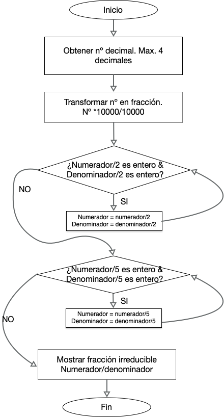
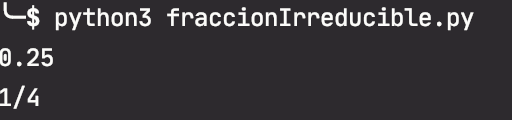
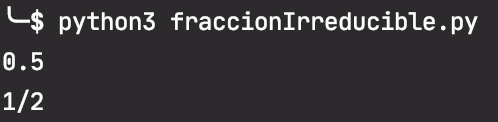
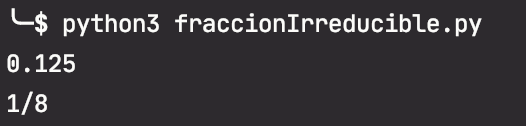
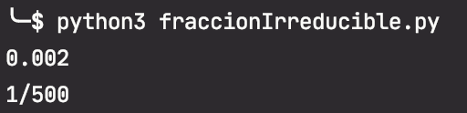
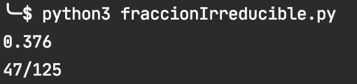

#Enunciado
Crea un programa que dado un número entre 0.0001 y 0.9999 (y de no más de 4 cifras decimales), obtenga y muestre la correspondiente fracción irreducible.

Por ejemplo, el número 0,25 se puede obtener a partir de 25/100, o de 2/8, o de 1/4, entre otros. La fracción irreducible es 1/4, que está formada por un numerador y un denominador que son primos entre sí.

Nota: el programa no debe avisar al usuario con mensajes como "Introduzca un número". Debe leer directamente el número que introduzca el usuario. De igual modo, sólo debe mostrar la fracción irreducible encontrada, nada más. Tampoco debe hacer ninguna pausa antes ni después de la ejecución.

# Solución
Para obtener la fracción irreducible de un número decimal de como máximo 4 decimales primero se representa el número en forma de fracción.

Como el número tendrá como máximo 4 decimales se utiliza 10.000 como denomindador. Para representar el número de entrada como fracción se multiplica y divide dicho número por  10000.

Las fracciones irreducibles son aquellas que no se pueden simplificar, lo que ocurre cuando el numerador y el denominador son primos entre sí.
Dos números son primos entre sí si no es posible encontrar un número por el que se puedan dividir ambos y obtener como resultado un número entero.

Para obtener fracciones equivalentes más sencillas de una dada se van dividiendo numerador y denominador por un mismo número para obtener fracciones reducidas más sencillas

Una opción  sencilla,sin hacer uso de funciones, sería hacer un bucle en el que se pruebe a dividir numerador y denominador por el mismo número comenzando por el número utilizado como numerador y reduciendo en 1 éste número en cada ejecución del bucle.
Otra opción más simplificada es que cómo se conoce que el denomindor es 10000 y su descomposición en factores primos es : 2^4 * 5^3, el denominador sólo es divisible por 2 y 5.

Cómo hay que dividir numerador y denominador por el mismo número basta con dividir ambos entre 2 tantas veces como se posible obtener un número entero y repetir el mismo proceso dividiendo entre 5.
Cada vez que en ambos casos la división sea entera se guarda el resultado como los nuevos valores de numerador y denominador para la siguiente iteración del bucle.

# Ejecución
Programa  realizado con python 3.8

En un ordenador con la versión 3.8 del interprete de python insgtalado situarse con el terminal en el directorio
donde se haya copiado el archivo fraccionIrreducible.py

Ejecutar `>pyhon3 fraccionIrreducible.py` 

Introducir un número decimal entre 0.0001 y 0.9999 y pulsar enter. Usar como sepador de decimales el '.'

Ejemplos:

