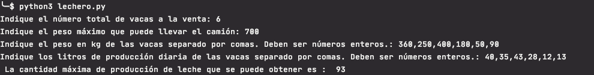
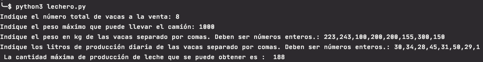
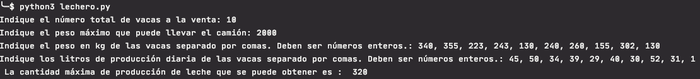

# Enunciado
Usted es un original empresario de Azkoitia, y tiene la brillante idea de abrir una tienda de la leche en la Plaza del pueblo.
Como es una persona muy prudente, desea que la leche que venderá sea perfectamente natural y fresca, y por esa razón,
va a traer unas sanísimas vacas desde Tolosa.
Dispone de un camión con un cierto límite de peso, y un grupo de vacas disponibles para la venta.
Cada vaca puede tener un peso distinto, y producir una cantidad diferente de leche al día.

Debes elegir qué vacas comprar y llevar en su camión, de modo que pueda maximizar la producción de leche, observando el límite de peso del camión.

1.- Para este propósito tienes que definir las siguientes entradas:
Entrada: Número total de vacas en la zona de Tolosa que están a la venta.
Entrada: Peso total que el camión puede llevar.
Entrada: Lista de pesos de las vacas.
Entrada: Lista de la producción de leche por vaca, en litros por día.

2.- El algoritmo que programes tiene que calcular la siguiente salida:
 Salida: Cantidad máxima de producción de leche se puede obtener.
  
Fuente: http://www.nachocabanes.com/retos/reto.php?n=07

# Solución
Una primera solución podría ser ordenar las vacas de mayor a menor producción diaria.
Por cada vaca comprobar si entra en el camión e ir seleccionando las que entren.
Esta opción no proporciona siempre la produción máxima posible.

Una opción simple, que permitiría obtener siempre la producción máxima posible,sería
probar cada posible combinación de vacas y quedarse con la que proporcione la mayor producción.
El problema de esta opción es que es muy lenta en cuanto aumenta el número de vacas.
Por cada vaca que se incluye, el número de opciones a calcular se duplica.
Es un algoritmo de complejidad exponencial O(2^n).

La solución que permite obtener siempre la producción máxima en un tiempo razonable es utilizar programación dinámica.
La programación dinámica consiste en ir solucionando subproblemas para utilizar dichas soluciones para resolver un problema mayor.
En este caso se van obteniendo las solución con camiones de menor capacidad y se usan esas soluciones para casos de
camiones con mayor capacidad.

Los problemas de programación dinámica utilizan una tabla para ir almacenando las soluciones.
Las columnas son los posibles pesos que admite el camión. En este caso suponemos que tanto el límite de capacidad del 
camión como los pesos de las vacas son números enteros, por lo que las columnas son los kilos de capacidad desde 1 kg hasta
el límite máximo del camión.
Las filas corresponde a las vacas. 

Cada celda se completa con la solución al problema correspondiente al peso máximo disponible indicado en la columna y
las vacas evaluadas hasta la actual. 
Para obtener esta solución se compara el peso de la vaca con el peso disponible
- Si el peso de la vaca es mayor, la vaca no se puede subir al camión por lo que la solución será la calculada con la vaca anterior
para el peso disponible. Esto se corresponde con la celda de la fila anterior y la misma columna.
- Si el peso es menor, la solución será el mayor valor de dos posibles opciones:
    - la solución para el peso disponible calculado con la vaca anterior. Valor de la fila anterior.
    - el valor obtenido de la producción de la vaca actual más la solución obtenida para la vaca anterior para el peso
     que queda disponible tras subir a la nueva vaca. Es decir, la fila anterior y la columna correspondiente al peso
     disponible menos el peso de la vaca actual.
Se van procesando todas las vacas y completando la tabla con todas las soluciones posibles.
La producción máxima a obtener será la solución para la última vaca y el peso máximo disponible correspondiente a la
última columna de la última fila de la tabla.

# Ejecución
Programa  realizado con python 3.8

En un ordenador con la versión 3.8 del interprete de python instalado situarse con el terminal en el directorio
donde se haya copiado el archivo lechero.py

Ejecutar `>pyhon3 lechero.py` 

Ejemplos:

