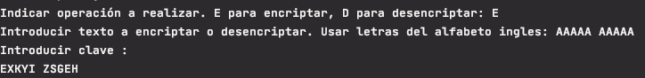
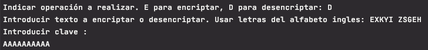
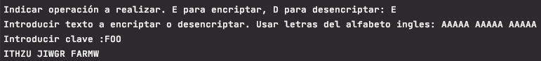
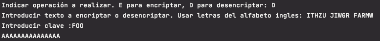
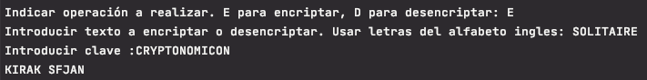
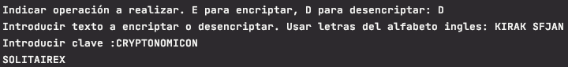

# Enunciado
El alumno debe construir una comunicación cifrada entre dos funciones utilizando el algoritmo del solitario:

1.- Una primera función a la que enviemos una variable (que será una frase o cadena de texto) para que la función lo cifre mediante el solitario. En programación existen diferentes tipos de variables: strings, enteros, flotantes, booleanos, ... y en este caso la variable o parámetro que se le envía a la función es de tipo String.

2.- Una segunda función que recoja el mensaje cifrado y lo descifre utilizando este mismo algoritmo.

[Algoritmo del solitario](https://sindominio.net/biblioweb/telematica/solitario.html)

# Solución
Basado en la descripción del algoritmo del solitario creo un programa con la siguiente estructura.

El código fuente se encuentra en la carpeta src del proyecto y los tests en la carpeta tests. (Aprovecho el ejercicio para empezar a practicar tdd con pytest.)
## pontifex.py
Contiene la función *main* que solicita la acción que se quire realizar: E - encriptar o D - desdencriptar

Solicita el texto a encriptar o desencriptar asi como la clave a utilizar la cual puede dejarse en blanco.

En función de la acción solicitada llama a la función *encrypt* o *decrypt* de la clase *Solitaire* pasandole el texto y la clave

## auxFuntions.py

Contiene funciones auxiliares para validar los datos de entrada.
Se convierten todas las entradas a mayúsculas.
Se comprueba que las cadenas solo contienen caracteres del alfabeto ingles.

## solitaire.py

Contiene la clase **Solitaire** que implementa el encriptado y desdencriptado.

Como **atributos** tiene un string con las letras del alfabeto y una baraja implementada por la clase *Deck*

Los métodos principales son **`encrypt(in_text, k)`** y **`decrypt(cipher_text, k)`**. El resto de métodos implementan los pasos necesarios para encriptar y desencriptar.

Como ejemplo indico de forma resumida. los pasos realizados en la encriptación y la generacíon del stream:

**_Encriptar_**

* Eliminar espacios en blanco en el mensaje
* Si la longuitud del mensaje no es múltiplo de 5 completar con X hasta que lo sea
* Convertir los caracteres del mensaje en números del 1 al 26 según su correspondiente posición en el alfabeto
* Converir los caracteres del mensaje en números del 1 al 26 según su correspondiente posición en el alfabeto. Si es un blanco se le asigna el valor 0.
* Generar el stream de letras aplicando el algoritmo del solitario y la clave
* Convertir los caracteres del mensaje en números del 1 al 26 según su correspondiente posición en el alfabeto
* Sumar en modulo 26 los numeros correspondientes al mensaje y al stream generado. El resultado serán números del 1 al 26.
* Convertir a texto los números obtenidos según su correspondiente posición en el alfabeto.
* Agrupar el texto resultante en grupos de 5 caracteres.

**_Generar stream_**

* Incializar la baraja con la clave. Al crear la baraja se da el orden por defecto. Si se pasa una clave que no esté en blanco se aplican los pasos necesarios para ordenar la baraja en función de dicha clave. Esta implementación la realiza la clase *Deck*
* Por cada caracter se aplican los pasos del algoritmo y se genera un número del 1 al 26 que se convierte en la correspondiente letra del alfabeto para generar el stream con tantos caracteres como el mensaje
* Los pasos para generar el número son:

	* 	mover el Joker A intercambiandolo con la carta que tiene debajo
	*  mover el Joker B colocandolo detras de las dos cartas que tiene debajo
	*  Hacer un triple corte en función de la posición de los Jokers
	*  Hacer un corte en función del valor de la última carta
	*  obtener la carta correspondiente al valor de la primera carta y obtener su valor si no es un joker. Si es un joker repetir el proceso.

## deck.py	
Contiene la clase **Deck** que implementa la funcionalidad de la baraja.

Como **atributos** tiene una lista con los palos de las cartas, una lista de objetos cartas implementados por la clase *Card* y la lista de números correspondientes a la clave a aplicar para ordenar la baraja.

El método ***`build()`*** crea la baraja con el orden por defecto indicado por el algoritmo

Otros métodos que implementa son:

* **`apply_key(key_numbers)`**: ordena la baraja en función de la clave de encriptación
* **`find_card_position_by_rank(rank)`:** devuelve la posición de una carta en función de su valor. Se utiliza para encontrar la posición de los Jokers
* **`move_card_one_position_down(position)`**: mueve la carta de la posición especificada una posición en la baraja según las reglas especificadas en el algoritmo
* **`move_card_two_position_down(position)`:** mueve la carta de la posición especificada dos posiciones en la baraja según las reglas especificadas en el algoritmo
* **`triple_cut (first_position, second_position)`**: realiza un triple corte en función de las posiciones de los jokers, según las reglas especificadas en el algoritmo
* **`count_cut(position)`**: realiza un corte en la baraja en función de posición especificada, según las reglas especificadas en el algoritmo.

## card.py
Contine la clase **Card** que implementa la funcionalidad de las cartas que componen la baraja.

Como **atributos** tiene el palo y el valor de la carta.

Los principales métodos son:

* **`card_to_number()`:** convierte la carta en su correspondiente número del 1 al 53 según las reglas especificadas en el algoritmo.
* **`is_joker()`**: indica si la carta es un joker
* **`card_to_number_1_to_26()`**: convierte la carta en su correspondiente número del 1 al 26 según las reglas especificadas en el algoritmo.

# Ejecución
Programa  realizado con python 3.8

En un ordenador con la versión 3.8 del interprete de python instalado situarse con el terminal en el directorio
donde se haya copiado el archivo pontifex.py

Ejecutar `>pyhon3 pontifex.py` 

Ejemplos:

Encriptar mensaje AAAAA AAAA con clave vacía

Desencriptar

Encriptar mensaje AAAAA AAAAA AAAAA con clave FOO

Desencriptar

Encriptar mensaje SOLITAIRE con clave CRYPTONOMICON

Desencriptar

