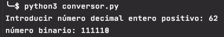
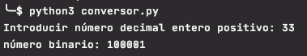
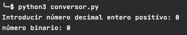
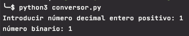

# Enunciado
desarrollar un programa donde una vez enviado un valor decimal a una función este lo convierta a binario y nos lo devuelva. Se trata de construir un simulador de
        
un convertidor analógico digital mediante un programa (software)

# Solución

Como números decimales para convertir a binario considero los enteros positivos incluidos el 0. Por ello, al solicitar los datos de entrada se realiza la validación para solo aceptar enteros positivos.

El proceso para convertir un número entero positivo en decimal consiste en realizar tantas veces como sea posible la divisón entera del número decimal entre dos hasta obtener un cociente de 1 ó 0.

Se van anotando cada uno de los restos obtenidos y el número binario será el compuesto por los números de la lista en orden inverso.

# Ejecución
Programa  realizado con python 3.8

El código fuente se encuentra dentro de la carpeta src y los tests dentro de la carpeta test.
Los tests se han realizado con pytests.

En un ordenador con la versión 3.8 del interprete de python instalado situarse con el terminal en el directorio donde se haya copiado el archivo conversor.py

Ejecutar `>pyhon3 conversor.py` 

Ejemplos:

