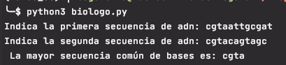

El objetivo de esta tarea es que vayáis cogiendo soltura programando, y para eso, debéis resolver los siguientes 3 algoritmos y dibujar sus diagramas de flujo correspondientes:

# El biólogo
## Enunciado

Eres un biólogo que examina secuencias de ADN de formas de vida diferentes. Se te darán dos secuencias de ADN, y el objetivo es encontrar el conjunto ordenado de bases adyacentes de mayor tamaño que es común en ambos ADNs.

Las secuencias de ADN se darán como conjuntos ordenados de bases de nucleótidos: adenina (abreviado A), citosina (C), guanina (G) y timina (T):

ATGTCTTCCTCGA TGCTTCCTATGAC

Para el ejemplo anterior, el resultado es CTTCCT porque que es el conjunto ordenado de bases adyacentes de mayor tamaño que se encuentra en ambas formas de vida.

## Solución

El programa solicita las dos cadenas de ADN a comparar asegurándose que tengan la estructura correcta: cadenas de texto formadas únicamente por combinaciones de los caracteres A, C, G y T

La función `find_common_sequence(seq1,seq2)` busca la cadena de mayor tamaño posible que es común en ambas cadenas de entrada. Para ello:

Se utiliza una variable *cadena_candidata* que se inicializa a vacio y que contendrá finalmente la cadena buscada.

También se usa una variable *nueva_candidata* que se va construyendo con los caracteres comunes encontrados al comparar las cadenas.

Para cada carácter de la primera secuencia de ADN se obtiene una lista de las posiciones en que ése caracter se encuentra en la segunda cadena de ADN. 

Por cada ocurrencia del carácter de la cadena 1 en la cadena 2 se van comparando los siguientes caracteres de ambas cadenas. Si coinciden se van añadiendo a la *nueva_candidata*.

Cuando no se encuentran más caracteres comunes se compara la *nueva_candidata* con la *cadena_candidata* y la de mayor longitud pasa a ser la *cadena_candidata*.

##Ejecución

El código fuente se encuentra dentro de la carpeta src y los tests dentro de la carpeta test.
Los tests se han realizado con pytests.

En un ordenador con la versión 3.8 del interprete de python instalado situarse con el terminal en el directorio donde se haya copiado el archivo biologo.py

Ejecutar `>pyhon3 biologo.py` 

Ejemplos:

# Invertir palabras
## Enunciado
Dada una serie de palabras separadas por espacios, escribir la frase formada por las mismas palabras en orden inverso.
Cada palabra estará formada exclusivamente por letras, y existirá exactamente un espacio entre cada pareja de palabras.
La salida debe ser "Case #" seguido del número de caso, de un símbolo de "dos puntos", de un espacio en blanco
y de la frase invertida

### Entradas y salidas de ejemplo
El primer dato de entrada será la cantidad de valores que se van a analizar.

**Ejemplo de entrada**

3

this is a test

foobar

all your base

**Salida correspondiente**

Case #1: test a is this

Case #2: foobar

Case #3: base your all

## Solución

El programa en primer lugar solicita la cantidad de frases que se van a analizar asegurándose que el valor indicado sea un número entero no negativo.

A continuacíon se solicitarán tantas frases correctas cómo se ha indicado en el valor anterior de frases a analizar. Utilizando una *expresión regular* se asegura que la frase tiene la estructuta correcta: está formada únicamente por letras y con un único espacio en blanco entre las palabras.

Cada frase correcta se guarda como elemento de una lista

Se recorre la lista con la función `enumerate` para obtener una tupla con la posición de la frase y la frase. Para cada frase se obtiene una lista con las palabras que la forman utilizando el método `split`. Se obtiene la lista de palabras en orden inverso utilizando el método `reverse`.

Se genera el string de salida utilizando la posición de la palabra para indicar el Case y se unen en un string separadas por un espacio en blanco las palabras de la lista inversa.

## Ejecución
El código fuente se encuentra dentro de la carpeta src y los tests dentro de la carpeta test.
Los tests se han realizado con pytests.

En un ordenador con la versión 3.8 del interprete de python instalado situarse con el terminal en el directorio donde se haya copiado el archivo reverse_words.py

Ejecutar `>pyhon3 reverse_words.py` 

Ejemplos:

# Palíndromos
## Enunciado
Un entero se dice que es un palíndromo si es igual al número que se obtiene al invertir el orden de sus cifras.
Por ejemplo, 79197 y 324423 son palíndromos. En esta tarea se le dará un entero N, 1 <= N <= 1.000.000.
Usted debe encontrar el menor entero M tal que M >= N que es primo y M es un palíndromo.

Por ejemplo, si N es 31, entonces la respuesta es 101.

Formato de entrada:
Un solo entero N, (1 <= N <= 1.000.000), en una sola línea.

Formato de salida:
Su salida debe consistir en un solo número entero, el más pequeño palíndromo primo mayor que o igual a N.

## Solución

El programa solicita un número entero entre 1 y 1.000.000 y se asegura que esté dentro del rango indicado.

Se comprueba si el número indicado es palíndromo y si es primo.Si no lo és se incrementa en uno el número y se vuelve a comprobar que el número cumpla las dos condiciones. Se repite el proceso hasta obtener un número que cumpla las dos condiciones.

Para comprobar si el número es palindromo se convierte el número en texto y se genera otra cadena de texto con las cifras obtenidas recorriendo las cifras del número original en sentido inverso. Se comparan ambas cadenas y si son iguales se indica que el número es palíndromo.

Para comprobar si el número es primo hay que comprobar que sea un número entero que no sea menor a 2 y que sólo sea divisible por 1 y el mismo.
Para comprobar si solo es divisible por el mismo se va dividiendo el número entre un divisor que comienza con el valor 2. Si el resto de la división no es 0 se incrementa en uno el divisor y se vuelve a dividir. El divisor se va incrementando hasta el valor del número menos uno o hasta que el resto de la división sea cero, lo que significa que el número es divisible por otro número que no es él mismo y por lo tanto no es primo.

## Ejecución

El código fuente se encuentra dentro de la carpeta src y los tests dentro de la carpeta test.
Los tests se han realizado con pytests.

En un ordenador con la versión 3.8 del interprete de python instalado situarse con el terminal en el directorio donde se haya copiado el archivo prime_palindromes.py

Ejecutar `>pyhon3 prime_palindromes.py` 

Ejemplos:

