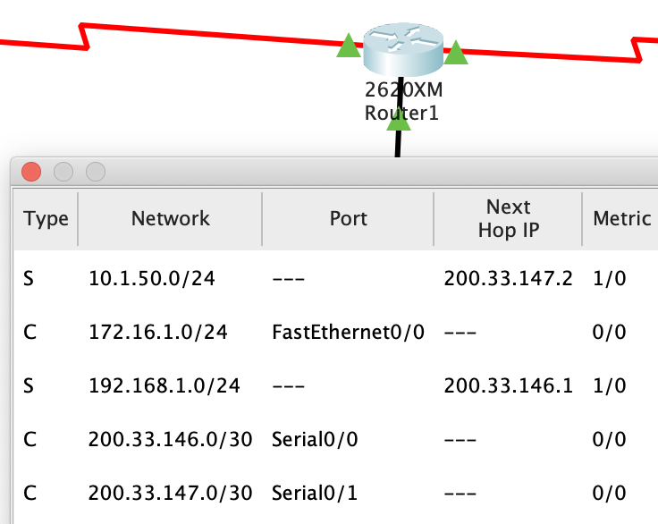

# Enunciado

Utilizar el simulador de redes Packet Tracer.

Para realizar la tarea debes:

1. Instalar el software en tu ordenador.

2. Empezar a entender cómo trabajar con este software y a profundizar en conceptos adquiridos en anteriores tareas.
3. Montar en el simulador las siguientes redes

	a.- Red con servidor web y servidor de DNS
	
	b.- Red con servidor DHCP
	
	c.- Red VLAN básica
	
	d.- Unir dos redes VLAN con un router
	
	e.- Enrutamiento estático
	
	

# Solución

## Red con servidor web y servidor de DNS

Se crea una red con dos PCs,un switch,un servidor web y un servidor dns.

Los Pcs y los servidores se conectan al switch por cable Ethernet y se
les asignan las direcciones IP y las máscaras indicadas en el enunciado.
En los PCs incluir como servidor DNS la IP asignada al servidor DNS

Se edita el archivo index.html del servidor web y se añade el párrafo " Esta es la página web por defecto".

En el servidor DNS activar el servicio DNS y asignar el dominio "www.miweb.com" a la dirección IP del servidor web.

## Red con servidor DHCP

Se crea una red con 5 PCs, un switch y un servidor.

Los Pcs y los servidores se conectan al switch por cable Ethernet.

Asignar la dirección IP indicada y la máscara de subred al servidor DCHP. Activar el servicio DHCP en el servidor y asignar las IPs del Gateway y el Servidor DNS. Cambiar el número máximo de usuarios a 100

Configurar la IP de los PCs para que utilizen DHCP y las IPs se asignan de forma automática.

## Red VLAN básica

Se crean dos VLAN cada una con un switch y cuatro PCs.

Se conectan los PCs al switch por cable Ethernet.
Los switchs se conectan conectan entre sí con cable cruzado en el puerto 24

En los switch se crean la VLAN2 con el nombre SISTEMAS y la VLAN3 con el nombre RECURSOSHUMANOS.
Asignar las interfaces 1 y 2 a la VLAN2 y las interfaces 3 y 4 a la VLAN3
A los PCs 0, 1, 4 y 5 se les asignan IPs de la subred 172.16.1.0 de la VLAN2 y a las PCs 2, 3, 6 y 7 se les asignan direcciones de la subred 172.16.2.0 de la VLAN3

Para que se puedan comunicar los PCs de cada VLAN se configuran los puertos 24 de los switch a modo trunk

## Unir dos redes VLAN con un router

Se crean 3 VLAN con un switch, 6 PCs y un router.

Configurar el switchs para crear 3 VLANS:

* VLAN 2: SISTEMAS. Se le asignan los puertos del 1 al 8
* VLAN 3: DESARROLLO. Se le asignan los puertos del 9 al 16
* VLAN 4: REDES. Se le asignan los puertos del 17 al 23

El puerto 24 se configura en modo trunk para conectarlo al router

Los PCs se conectan por Ethernet al Switch. El gateway será la IP del router para cada interface.

Los PCs 0 y 1 se conectan por Ethernet a los primeros puertos de la VLAN 2 y se les asigna direcciones IP de la subred correspondiente.

Los PCs 2 y 3 se conectan por Ethernet a los primeros puertos de la VLAN 3 y se les asigna direcciones IP de la subred correspondiente.

Los PCs 4 y 5 se conectan por Ethernet a los primeros puertos de la VLAN 4 y se les asigna direcciones IP de la subred correspondiente.

Se configura el router para permitir la comunicación entre las VLANs asignando la IP del Gateway correspondiente para la interface de cada VLAN

## Enrutamiento estático

Se crea una red con tres routers, tres switches y 6 PCs.

Instalar en los Routers la interfece serie WIC-2T para que se puedan conectar en serie entre ellos.

Se conectan dos PCs a cada swith por Ethernet. Cada switch se conectan a un router por Ethernet en el puerto 24

Se configuran los routers. En la interface Ethernet se asignan la ip y la mascara de cada subred. En la interface serie se asignan las ips correspondientes y el clock Rate. Se añaden las ips para el enrutamiento estático. 

A los PCs se les asignan las IPs correspondientes a su subred. El gateway será la IP de la interface del router para cada red.

# Ejecución

En un ordenador en el que esté instalado el simulador Packet Tracer abrir los archivos .pkt:

## Red con servidor web y servidor de DNS
 Abrir el archivo `Red_con_servidor_web_y_DNS.pkt`
 
 Desde uno de los PCs acceder al web broser y acceder a www.miweb.com
 
 
 
 
## Red con servidor DHCP
 
Abrir el archivo `Red_con_servidor_DCHP.pkt`
Desde la consola de comandos de uno de los PCs se puede comprobar la configuración IP del PC y la conexión con otro PC y el gateway

## Red VLAN básica

Abrir el archivo `Red_VLAN_basica.pkt`
Comprobar que se pueden mandar mensajes entre los PCs de la misma VLAN, PC4 y PC0 en VLAN2 y PC6 y PC3 en VLAN3. Entre equipos de distintas VLANs no se pueden mandar mensajes.

## Unir dos redes VLAN con un router
Abrir el archivo `Red_3_VLANs_con_router.pkt`
Comprobar que se pueden mandar mensajes desde todas las VLAN al router y entre distintas VLANs. Puede que tarde un poco en estar completamente activa la tabla de enrutamiento.
 
 
 
 
## Enrutamiento estático

Abrir el archivo `Red_con_enrutamiento_estático.pkt`
Comprobar la tabla de enrutamiento de los routers y que se pueden enviar mensajes entre las distintas subredes.

 
 
 
 
 
 
 