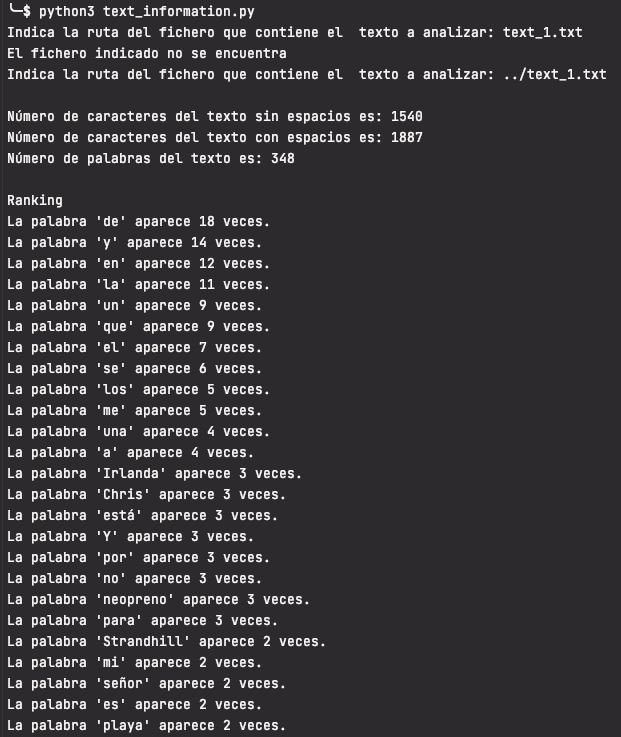
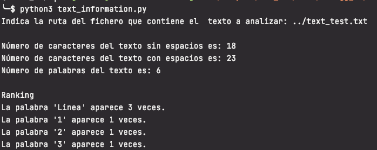

## Enunciado
mediante técnicas de Regex debe
calcular el número de caracteres, el número palabras y ranking de palabras por frecuencia de uso
del siguiente texto. La aplicación debe servir para cualquier otro texto:

"En Strandhill, Irlanda, se cruzó en mi camino Chris, un señor de los que inspiran y se posicionan como
referente. Fue una pieza fundamental en un momento de pura congelación. Te cuento?
Strandhill es una playa donde el mar ruge muy bien, siempre está lleno de surfistas en busca de buenas
olas. Y allí estaba yo también. Después de unos meses viviendo en una ciudad sin costa, mis ganas por
hacer un poco de surfing estaban por las nubes. Aunque tenía un «pequeño» problema: no tenía equipo,
ni tabla, ni neopreno, y tampoco había ninguna tienda para alquilarlo.
Todo se puso a rodar enseguida. Escribí a un famoso surfista de la zona y recibí una respuesta
increíble. «Mi casa está en la calle x, la puerta está abierta y tienes la tabla en la esquina. Ven cuando
quieras», me dijo. Y eso hice, fui para allá y la cogí. Aunque el neopreno no me lo pudo prestar, y no
porque se negara? Lamentablemente le sacaba unos 15 cm de altura. Luego, en la playa, un alemán me
solucionó el tema del neopreno. Me prestó uno que había por su maletero, uno muy fino, de los que uso
yo en el Mediterráneo en otoño o primavera. Y claro, era invierno y estábamos en Irlanda.
El caso es que salí del agua más pronto de lo previsto y con las manos, la cabeza y los labios
congelados. Me empecé a cambiar en el mismo paseo que contorneaba la costa y, estando
semidesnudo, se me acercó Chris. «Está fría el agua, eh», apuntó este fenómeno.
Chris superaba los 65 años y todos los días hacía un recorrido de decenas de kilómetros para llegar
hasta allí. Sus gracietas y su buena conversación me hicieron apartar el frío de la parte de mi cabeza que
se encarga de pensar, y hasta cantamos juntos la canción de Annie.
Sé que esto último puede sonar raro, ¿quién canta Annie semidesudo y congelado en un paseo de
Irlanda con un señor que acaba de conocer? Pero? seguro que a ti también te han pasado cosas así."

## Solución

El programa obtiene el texto a analizar de un fichero de texto, por lo que solicita la ruta del fichero hasta obtener una rúta válida. La funcíon `get_correct_input_text` comprueba que la ruta del fichero tenga extensión "txt" o "rtf", además de que el fichero exista y se pueda leer correctamente.

Para obtener las palabras que contiene el texto y el número de caracteres, tanto teniendo en cuenta los caracteres de espacio cómo sin ellos, se utilizan distintas expresiones regulares. 
Para utilizar expresiones regulares se importa el paquete re. La función `get_all_matches(regex, input_text)` crea un objeto patrón utilizando la función compile de re y la expresión regex pasada como parámetro. Utiliza el método findall del objeto patrón para obtener todas las coincidencias del patrón en el string pasado como parámetro.

Las funciones `get_words(input_text)`, `get_characters_with_spaces(input_text)` y `get_charatects_without_spaces(input_text)` utilizan la función `get_all_matches(regex, input_text)` pasándole la expresión regular apropiada en cada caso. En todos los casos se imprime la longitud de la lista obtenida con las coincidencias.

La función `print_word_frequency_sorted(words_frequency)` imprime el ranking de la frecuencia de cada palabra. Para ello, recibe un diccionario con las palabras como clave y su frecuencia como valor. El diccionario lo genera la función `get_word_frequency(words)` que recibe la lista de palabras obtenidas en la llamada a `get_words(input_text)`. Recorre la lista de palabras y crea el diccionario asignando el número de ocurrencias de la palabra, utilizando el método `count()` de la lista.
Para obtener el ranking ordenado, se aplica la función `sorted()` a los elementos del diccionario. Utilizando el módulo `operator` se puede especificar el elemento por el que se quiere ordenar, en este caso por el valor. El resultado es una lista ordenada de tuplas cuyos elementos son la palabra y la su frecuencia.

## Ejecución

El código fuente se encuentra dentro de la carpeta src y los tests dentro de la carpeta test.
Los tests se han realizado con pytests.

En un ordenador con la versión 3.8 del interprete de python instalado situarse con el terminal en el directorio donde se haya copiado el archivo text_information.py

Ejecutar `>pyhon3 text_information.py` 

El programa solicitará la ruta del fichero que contiene el texto a analizar.
En el directorio de la tarea hay dos ficheros para hacer pruebas: 
 * text_1.txt: con el texto del enunciado
 * text_test.txt: con otro texto.

Para utilizarlos basta con indicar que se encuentran en el directorio superior y el nombre: `../text_1.txt`

Se puede utilizar cualquier otro fichero indicando su ruta completa.

Ejemplos:

