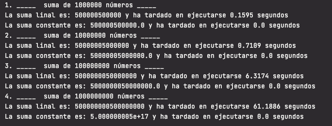

# Enunciado

Programar el problema que se plantea en la siguiente secuencia de videos en el lenguaje de programación que desees.
 
1.- [https://www.youtube.com/watch?v=GD254Gotp-4](https://www.youtube.com/watch?v=GD254Gotp-4)

2.- [https://www.youtube.com/watch?v=MaY6FpP0FEU](https://www.youtube.com/watch?v=GD254Gotp-4)

# Solución

El reto consiste en definir dos funciones para calcuar la suma de 1 a n números. Una de ella sumando uno a uno cada número, y la otra aplicando la fórmula de la suma aritmética de Gauss.

La función `suma_lineal(n)` suma uno a uno cada número utilizando un bucle for que recorre los números de 1 a n y suma cada uno a la suma de los anteriores.

La función `suma_constante(n)` aplica la fórmula de Gauss: **(n/2)*(n+1)**

Se llamará 4 veces a ambas funciones con un valor de n inicial de 1.000.000. En cada llamada el valor de n se multiplica por 10.

Para cada valor de n se mide el tiempo que tarda en ejecutarse cada una de las funciones y se muestra.

Se puede observar que la suma líneal cada vez tarda más tiempo en ejecutarse. Su rendimiento depende linealmente de la cantidad de elementos de la entrada.Por lo tanto, tiene una complejidad de  tiempo lineal: O(n)

En cambio la suma constante siempre tarda lo mismo, independientemente de la cantidad de elementos de la entrada. Por lo tanto, tiene una complejidad de tiempo constante: O(1)

## Ejecución

El código fuente se encuentra dentro de la carpeta src.

En un ordenador con la versión 3.8 del interprete de python instalado situarse con el terminal en el directorio donde se haya copiado el archivo suma_n_numeros.py

Ejecutar `>pyhon3 suma_n_numeros.py` 

Ejemplo:

