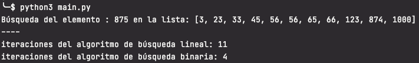

# Enunciado

Tenemos la siguiente lista de elementos: [3, 56, 21, 33, 874, 123, 66, 1000, 23, 45, 65, 56].

1. Construye tu propio algoritmo para ordenarlo de menor a mayor.
2. Busca el número 875 utilizando el algoritmo secuencial y el binario. En cada iteración se debe sumar +1 de modo que al final del programa se debe indicar el número de iteraciones realizadas por cada algoritmo hasta encontrar el elemento.
3.  Realiza el análisis en Notación Big O (visto en la tarea #44) y describe tu conclusiones en un documento de texto.

# Solución

En esta ocasión el el programa no solicita datos de entrada ya que están fijados por el enunciado.

La lista original se ordena de menor a mayor utilizando una implementación simple del algoritmo de ordenación quicksort. Ésta se encuentra en `sort_algorithms.py`. La búsqueda lineal permite tanto listas desordenadas como ordenadas. La búsqueda binaria sólo se puede realizar en lista ordenadas.

En `search_algorithms.py` se encuentran las implementaciones del algoritmo de búsqueda lineal y búsqueda binaria. En este caso no indican si han encontrado o no el elemento o la posición del elemento encontrado sino que devuelven el número de iteraciones realizadas para buscar el elemento.

Se llama a ambos algoritmos de búsqueda pasandoles la lista ordenada y el elemento a buscar. Se muestra por pantalla el número de iteraciones que ha necesitado cada uno de los algoritmos.

El valor 875 no se encuentra en la lista, lo que implica realizar el peor de los casos, es decir el máximo de iteraciones necesarias para cada algoritmo.

## Análisis en notación Big O

El **algoritmo de búsqueda lineal** realiza 11 iteraciones, que se corresponden con el número de elementos de la lista. Al ir buscando secuencialmente necesita recorrer toda la lista para determinar que el elemento buscado no está en la lista. Esto implica que para el peor de los casos su complejidad depende del número de elementos que contenga la lista. O(n). Su complejidad aumenta de forma lineal a la cantidad de elementos de la lista.

El **algoritmo de búsqueda binaria** realiza 4 iteraciones. Es mucho más eficiente que la búsqueda lineal ya que utiliza la técnica de divide y vencerás y en cada iteración va disminuyendo el tamaño de la lista en la que buscar a la mitad. Su complejidad es O(log n). El logaritmo de un número real positivo es el exponente al que hay que elevar la base para obtener dicho número. El logaritmo en base 2 de 11 es 3,46,es decir, son necesarias 4 iteraciones.  Esto quiere decir que es necesario dividir 4 veces a la mitad los datos de entrada, 11, para llegar a un único valor (el buscado).

Para n=11 la diferencia no es muy grande, pero si se incrementasen mucho los datos y n fuese 15.000.000,
el algoritmo de búsqueda lineal necesitaría 15.000.000 de iteraciónes para determinar que un elemento no se encuentra en la lista, mientras que la búsqueda binaria necesitaria 24 iteraciones. Es muy importante tener en cuenta la complejidad de los algoritmos cuando se trabaja con grandes volúmenes de datos.

# Ejecución
El código fuente se encuentra dentro de la carpeta src y los tests dentro de la carpeta test.
Los tests se han realizado con pytests.

En un ordenador con la versión 3.8 del interprete de python instalado situarse con el terminal en el directorio donde se haya copiado el archivo main.py

Ejecutar `>pyhon3 main.py` 

Ejemplos:

