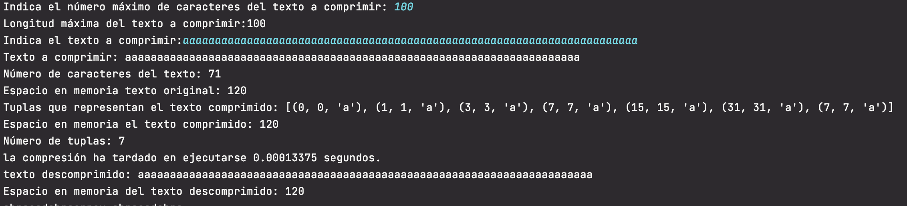
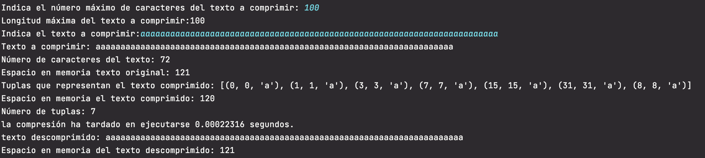

# Enunciado

De una cadena dada de máximo 30 caracteres debéis construir una función
que comprima la cadena mediante LZ77 y una función que la descomprima. Evidentemente el input y el
output deben coincidir:

**1.-** Recoger el input de máximo 30 caracteres

**2.-** Hacer un print que informe sobre el espacio de memoría que ocupa el string introducido.

**3.-** Comprimir

**4.-** Hacer un print que informe sobre el espacio de memoría que ocupa el string comprimido.

**5.-** Descomprimir. El output debe ser igual que el input.

**6.-** Hacer un print que informe sobre el espacio de memoría que ocupa el string descomprimido. Una vez
descomprimido debería tener el mismo peso que el original.

# Solución

##LZ77

Conceptos utilizados en el algoritmo:

* **Cadena de entrada**: secuencia de caracteres a comprimir
* **Posición a codificar**: posición del caracter de la cadena de entrada que está analizando para codificar (el comienzo del buffer de búsqueda)
* **Buffer de búsqueda (Lookahead buffer)**:la secuencia de caracteres desde la posición a codificar hasta el final de la cadena de entrada
* **Ventana (window)** :que contiene los caracteres que se han codificado anteriormente
* **Posicon en la ventana (window_position)**: posicion en la ventana donde comienza la secuencia coincidente con el buffer de búsqueda

La cadena de entrada se va dividiendo dinámicamente en dos partes.  La ventana que contiene los caracteres ya analizados y el buffer de búsqueda que va desde el final de la ventana al final de la cadena de entrada. 

A la función **comprimir** `compress()`se le puede indicar un tamaño máximo tanto para el buffer como para la ventana. Si no se especifican el tamaño de ambos será igual al tamaño del texto de entrada. Los tamaños de la ventana y el buffer se pueden limitar por razones de rendimiento para cadenas de entrada muy largas.

El algoritmo de compresión consiste en ir analizando los caracteres de la cadena de entrada. El carácter o caracteres a analizar son los del buffer de búsqueda. En la ventana se busca la coincidencia más cercana al comienzo de buffer que coincida con el contenido del buffer de busqueda. Si se encuentra se va ampliando el buffer de búsqueda para buscar secuencias más largas. 

La idea es sustituir secuencias de caracterés que ya existen previamente por referencias a su posición anterior. Esta codificadión se realiza mediante una lista de tuplas de tres elementos:

* **distancia** hasta la posición en la ventana donde comienza la cadena codificada
* **longitud** de la cadena codificada 
* **siguiente carácter**  

En el caso de que el buffer sólo contiene un caracter y no se ha encontrado coincidencia en la ventana su código será:

* distanticia 0
* longitud de la cadena 0
* caracter no encontrado en la ventana

En el caso de que se halla encontrado coincidencia en la ventana, el código será:

 * la distancia del puntero a la posición de la cadena en la ventana
 * longitud del buffer o cadena encontrada
 * siguiente caracter de la cadena original

Para **descoprimir** se va analizando la lista de tuplas resultante de la compresión para componer el texto original

Si el primer elemento de la tupla no es 0 se asigna al texto descomprimido el substring del texto descomprimido, que comienza en el tamaño actual del texto descomprimido menos el desplazamiento indicado en la primera posición de la tupla, y que finaliza tantas posiciónes después como indica el segundo elemento de la tupla. Se añade además el caracter del tercer elemento de la tupla

Si el primer elemento de la tupla es 0 se añade al texto descomprimido el tercer elemento de la tupla.

## Compresion y longitud máxima de la cadena de entrada

El enunciado indica un longuitud máxima de cadena de entrada de 30 caracteres. Con esta longuitud de cadena no se puede comprobar el beneficio del efecto en memoria de la compresión ya que la estructura de tuplas en una lista ocupa más espacio en memoria que   un string.

Si se usa como cadena de entrada un sólo carácter su espacio en memoria es 50 bytes y el espacio de la lista con la tupla de tres valores necesarios para representarlo ocupa 88 bytes.

Para poder comprobar el efecto de ocupación en memoria de la compresión se permite indicar al usuario el tamaño máximo de la cadena de entrada a comprimir. Si se pulsa intro se mantiene la longitud máxima por defecto de 30.

La cadena formada por 30 aes tiene un espacio en memoria de 79 bytes y la lista de 5 tuplas necesarias para representarla ocupan 88 bytes.

### Pruebas de efecto de la compresión

Para una cadena de 71 aes el espacio del texto original y el comprimido es igual.

A partir de 72 caracteres es cuando se empieza a conseguir reducción de espacio en memoria.

Para una cadena de 300 caracteres se puede observar un mayor efecto de la compresión pasando de 349 bytes a 184 bytes

Para textos muy grandes el tamaño máximo del buffer y la ventana pueden afectar al rendimiento y velocidad de compresión. El algoritmo está preparado para recibir un tamaño máximo del buffer y de ventana. Se pueden hacer pruebas modificando las llamadas al compresor en el main.py

# Ejecución

El código fuente se encuentra dentro de la carpeta src y los tests dentro de la carpeta test.
Los tests se han realizado con pytests.

En un ordenador con la versión 3.8 del interprete de python instalado situarse con el terminal en el directorio donde se haya copiado el archivo main.py

Ejecutar `>pyhon3 main.py` en un mac o `>pyhon main.py` en windows

Ejemplos:

## Ejecución de los tests

Para ejecutar los tests desde el terminal es necesario instalar pytest

[https://docs.pytest.org/en/latest/getting-started.html](https://docs.pytest.org/en/latest/getting-started.html)

`pip install -U pytest`

Para ejecutar los test desde el teminal situarse en el directorio src. El mismo desde el que se ejecuta main.py

Ejecutar `python3 -m pytest -v ../test`

