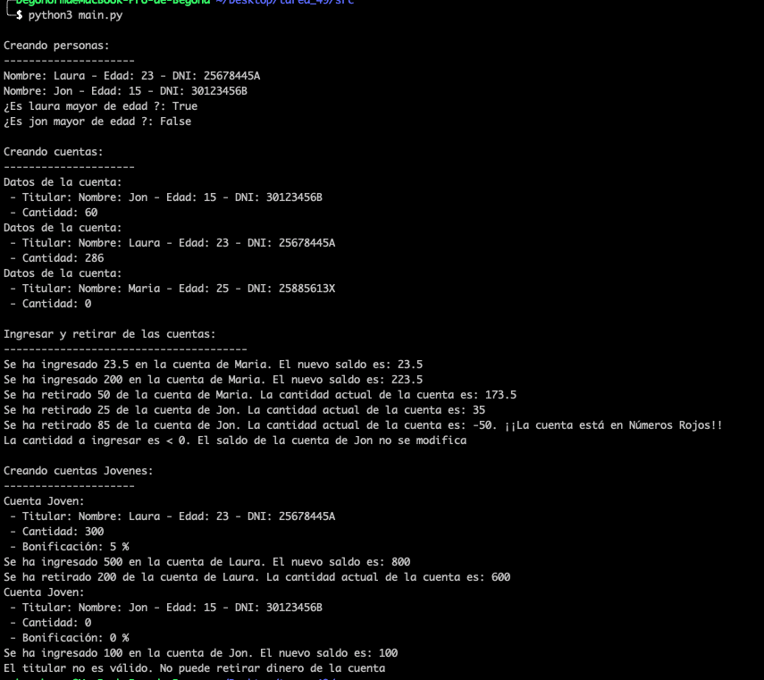
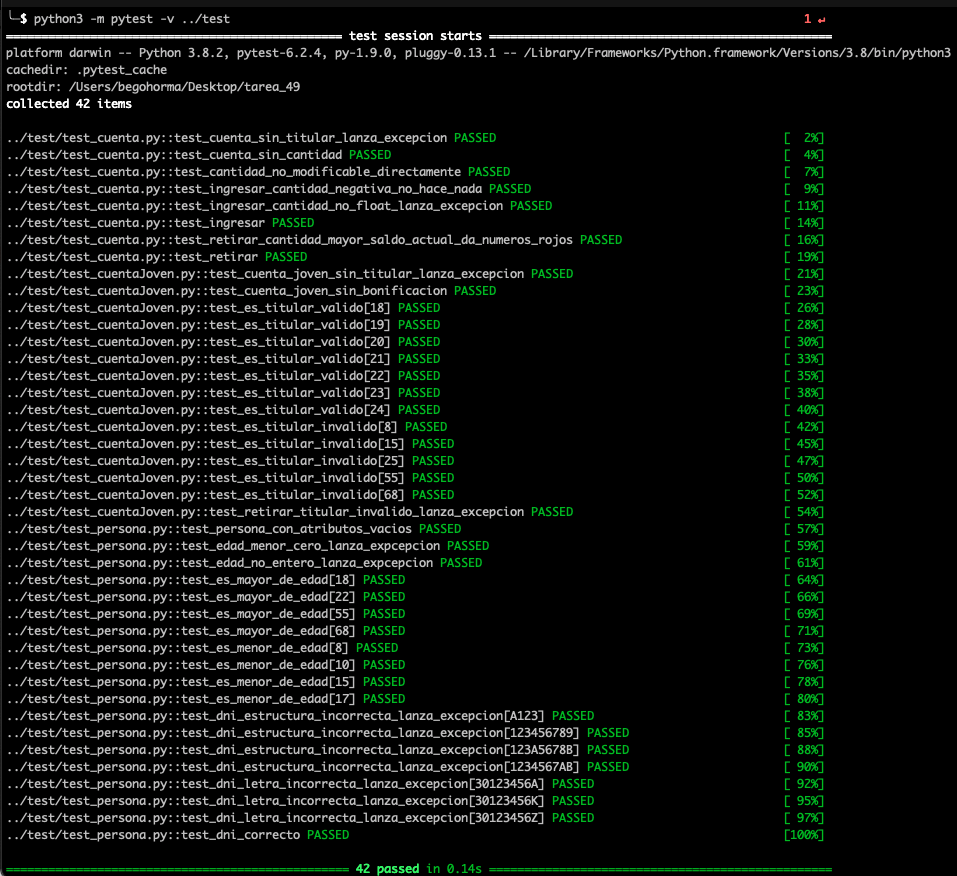

# Enunciado
##Ejercicios de programación orientada a objetos
###Ejercicio 1
Vamos a crear una clase llamada Persona. Sus atributos son: nombre, edad y DNI. Construye los siguientes métodos para la clase:

* Un constructor, donde los datos pueden estar vacíos.
* Los setters y getters para cada uno de los atributos. Hay que validar las entradas de datos.
* `mostrar()`: Muestra los datos de la persona.
* `esMayorDeEdad()`: Devuelve un valor lógico indicando si es mayor de edad.

###Ejercicio 2
Crea una clase llamada Cuenta que tendrá los siguientes atributos: titular (que es una persona) y cantidad (puede tener decimales). El titular será obligatorio y la cantidad es opcional. Construye los siguientes métodos para la clase:

* Un constructor, donde los datos pueden estar vacíos.
* Los setters y getters para cada uno de los atributos. El atributo no se puede modificar directamente, sólo ingresando o retirando dinero.
* `mostrar()`: Muestra los datos de la cuenta.
* `ingresar(cantidad)`: se ingresa una cantidad a la cuenta, si la cantidad introducida es negativa, no se hará nada.
* `retirar(cantidad)`: se retira una cantidad a la cuenta. La cuenta puede estar en números rojos.

###Ejercicio 3
Vamos a definir ahora una “Cuenta Joven”, para ello vamos a crear una nueva clase CuantaJoven que deriva de la anterior. Cuando se crea esta nueva clase, además del titular y la cantidad se debe guardar una bonificación que estará expresada en tanto por ciento.Construye los siguientes métodos para la clase:

* Un constructor.
* Los setters y getters para el nuevo atributo.
* En esta ocasión los titulares de este tipo de cuenta tienen que ser mayor de edad., por lo tanto hay que crear un método `esTitularValido()` que devuelve verdadero si el titular es mayor de edad pero menor de 25 años y falso en caso contrario.
* Además la retirada de dinero sólo se podrá hacer si el titular es válido.
* El método `mostrar()` debe devolver el mensaje de “Cuenta Joven” y la bonificación de la cuenta.

# Solución

Se crean las clases indicadas en los ejercicios y los tests correspondientes para comprobar que se cumplen los requisitos indicados.

# Ejecución

El código fuente se encuentra dentro de la carpeta src y los tests dentro de la carpeta test.
Los tests se han realizado con pytests.

En un ordenador con la versión 3.8 del interprete de python instalado situarse con el terminal en el directorio donde se haya copiado el archivo main.py

Ejecutar `>pyhon3 main.py` 

Ejemplos:

## Ejecución de los tests

Para ejecutar los tests desde el terminal es necesario instalar pytest

[https://docs.pytest.org/en/latest/getting-started.html](https://docs.pytest.org/en/latest/getting-started.html)

`pip install -U pytest`

Para ejecutar los test desde el teminal situarse en el directorio src. El mismo desde el que se ejecuta main.py

Ejecutar `python3 -m pytest -v ../test`

