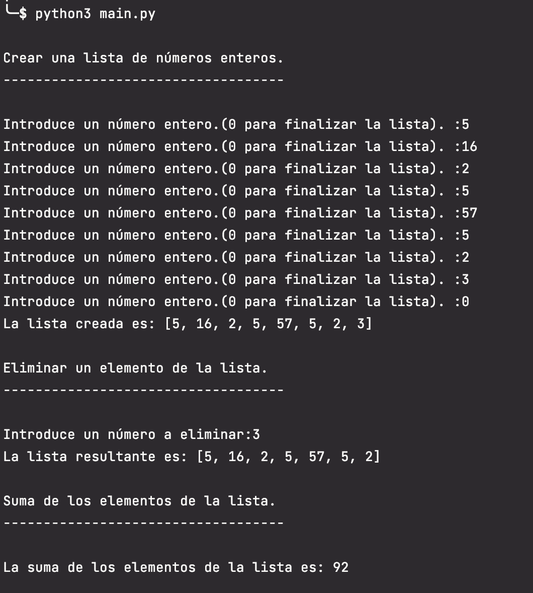
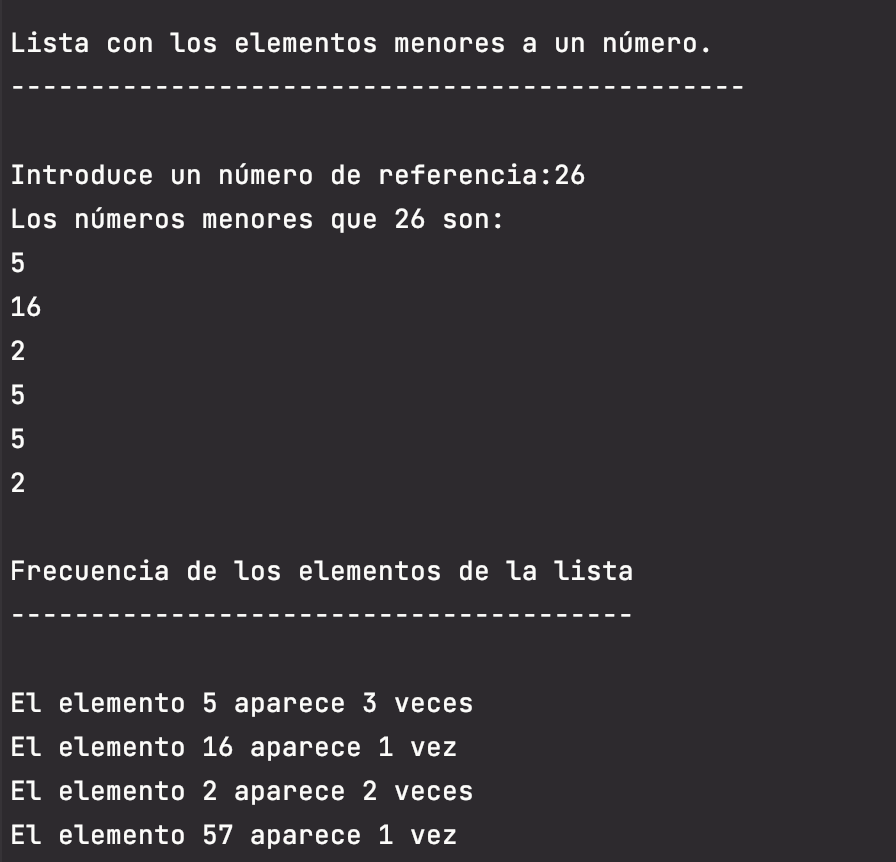
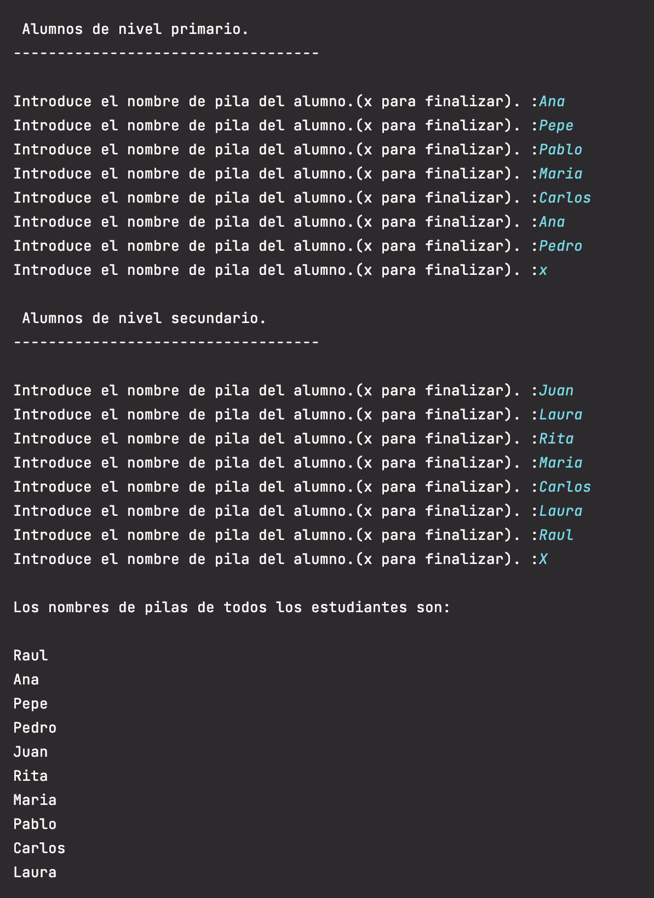
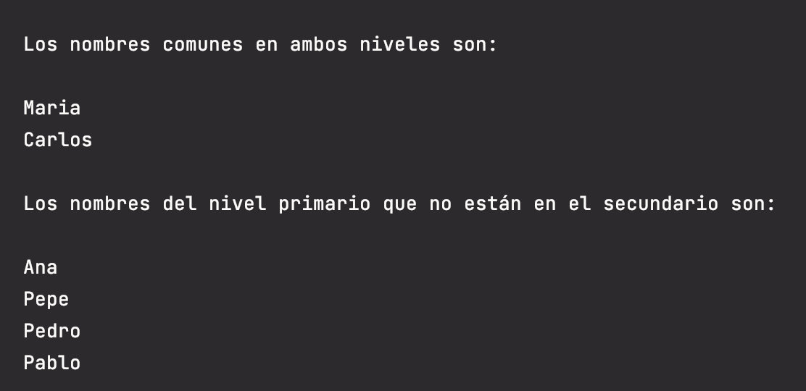

# Enunciado

## Ejercicios de estructuras de datos

### Ejercicio 1
Desarrolla un programa que sirva para:

- Solicitar al usuario que ingrese números, los cuales se guardarán en una lista. Finalizar al ingresar el número 0, el cual no debe guardarse.
- A continuación, solicitar al usuario que ingrese un número y, si el número está en la lista, eliminar su primera ocurrencia. Mostrar un mensaje si no es posible eliminar.
- Recorrer la lista para imprimir la sumatoria de todos los elementos.
- Solicitar al usuario otro número y crear una lista con los elementos de la lista original que sean menores que el número dado. Imprimir esta nueva lista, iterando por ella.
- Generar e imprimir una nueva lista que contenga como elementos a tuplas de dos elementos, cada una compuesta por un número de la lista original y la cantidad de veces que aparece en ella. Por ejemplo, si la lista original es [5,16,2,5,57,5,2] la nueva lista contendrá: [(5,3), (16,1), (2,2), (57,1)]

### Ejercicio 2
Solicitar al usuario que ingrese los nombres de pila de los alumnos de nivel primario de una escuela, finalizando al ingresar ?x?.

A continuación, solicitar que ingrese los nombres de los alumnos de nivel secundario, finalizando al ingresar ?x?.

- Informar los nombres de todos los alumnos de nivel primario y los de nivel secundario, sin repeticiones. - Informar qué nombres se repiten entre los alumnos de nivel primario y secundario.
- Informar qué nombres de nivel primario no se repiten en los de nivel secundario.

El alumno debe decidir qué estructura de datos es la más conveniente para el desarrollo de los programas.

# Solución

## Ejercicio 1

La estructura de datos utilizada para este ejercicio son listas ya que se especifica en el enunciado.

En el método *main* de `main.py` se van indicando los pasos que realiza el programa, solicitando los datos y mostrando el resultado de las llamadas a las funciones de `aux_functions.py` que implementan cada una de las funcionalidades requeridas.

## Ejercicio 2

La estructura de datos utilizada para este ejercicio son los conjuntos o set ya que sólo se quieren conocer los valores únicos de los nombres de los alumnos de cada nivel y hacer comparaciones entre ambos niveles. Las propiedades de los conjuntos permiten obtener esta información concreta de forma más sencilla que otras estructuras de datos.

# Ejecución

## Ejercicio 1

El código fuente se encuentra dentro del directorio Ejercicio_1, en la carpeta src y los tests dentro de la carpeta test.

Los tests se han realizado con pytests.

En un ordenador con la versión 3.8 del interprete de python instalado situarse con el terminal en el directorio donde se haya copiado el archivo main.py correspondiente al ejercicio 1

Ejecutar `>pyhon3 main.py` 

Ejemplos:

## Ejercicio 2

El código fuente se encuentra dentro del directorio Ejercicio_2, en la carpeta src.

En un ordenador con la versión 3.8 del interprete de python instalado situarse con el terminal en el directorio donde se haya copiado el archivo main.py correspondiente al ejercicio 2

Ejecutar `>pyhon3 main.py` 

Ejemplos:

## Ejecución de los tests

Para ejecutar los tests desde el terminal es necesario instalar pytest

[https://docs.pytest.org/en/latest/getting-started.html](https://docs.pytest.org/en/latest/getting-started.html)

`pip install -U pytest`

Para ejecutar los test desde el teminal situarse en el directorio src. El mismo desde el que se ejecuta main.py

Ejecutar `python3 -m pytest -v ../test`
