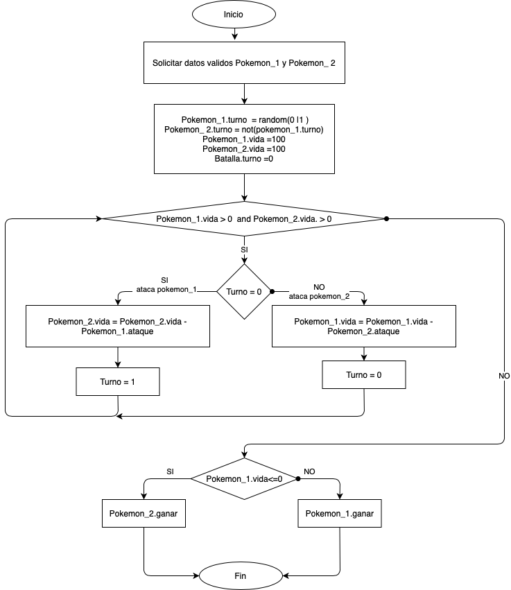
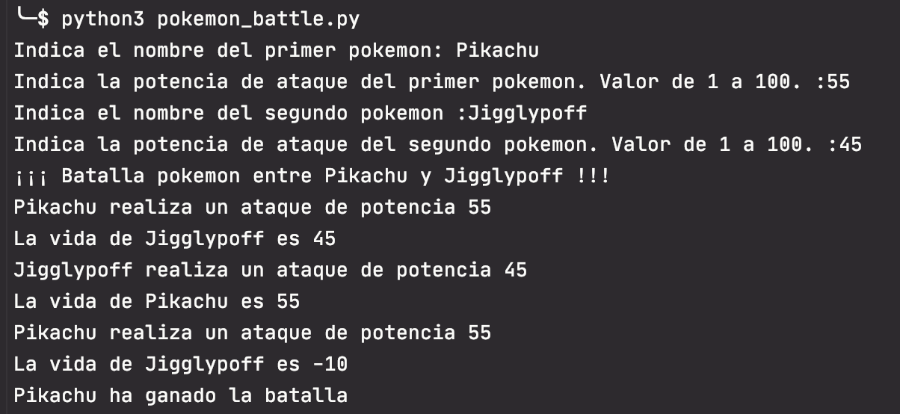
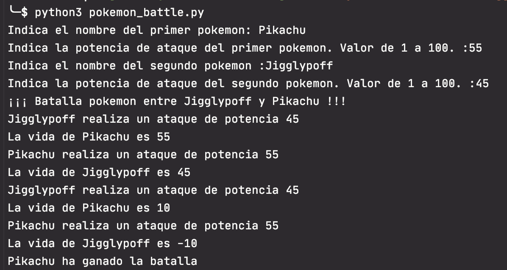

# Enunciado
En este caso, apoyándoos en el siguiente video, tenéis que entender y dibujar el diagrama de flujo del programa de 
Pikachu. Posteriormente debéis codificarlo en Python.

[Video](https://www.youtube.com/watch?v=SDv2vOIFIj8)

# Solución

He realizado algunas modificaciones respecto al video original:

* El programa solicita los datos de los dos pokemons que van a pelear.
  Validando que el valor de ataque de los pokemons esté entre 0 y 100 incluidos.
* El turno para atacar se genera de forma aleatoria y se asigna a cada pokemon creado.
  El que tenga el turno 0 será el primero en atacar

El código se estructura en los siguientes ficheros:

* **pokemon_battle.py**: solicita los datos de entrada de los pokemons.
  Genera el valor del turno para el primer pokemon de forma aleatoria.
  Crea los objetos pokemon con su turno. Crea la batalla y llama a la función battle pasándole los dos pokemons.

* **aux_functions.py**: contiene función auxiliar para validar el valor del ataque de los pokemons.

* **pokemon.py**: contiene la clase Pokemon. Crea los objetos pokemon con los atributos name, attack, turn y life. 
  La vida se inicializa a 100. Contiene los métodos para acceder a los atributos y los métodos attack(), win() y life()
  en los que muestra las acciones e información del pokemon.

* **battle.py**: contiene la clase Battle que implementa la lógica de la batalla.
  Tiene una variable estática para el turno y como atributos pokemon 1, que será el primero en atacar, y pokemon 2.
  La lógica se muestra en el diagrama de flujo.

# Ejecución
Programa realizado con python 3.8

El código fuente se encuentra dentro de la carpeta src y los tests dentro de la carpeta test.
Los tests se han realizado con pytests.

En un ordenador con la versión 3.8 del intérprete de python instalado situarse con el terminal en el directorio donde
se haya copiado el archivo pokemon_battle.py

Ejecutar `>pyhon3 pokemon_battle.py` en un mac o `>pyhon pokemon_battle.py` en windows

Ejemplos:

Ataca primero Pikachu

Ataca primero Jigglypoff

